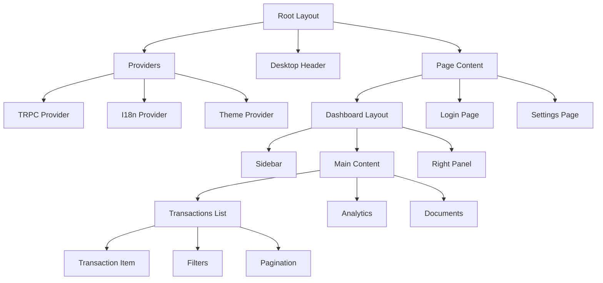
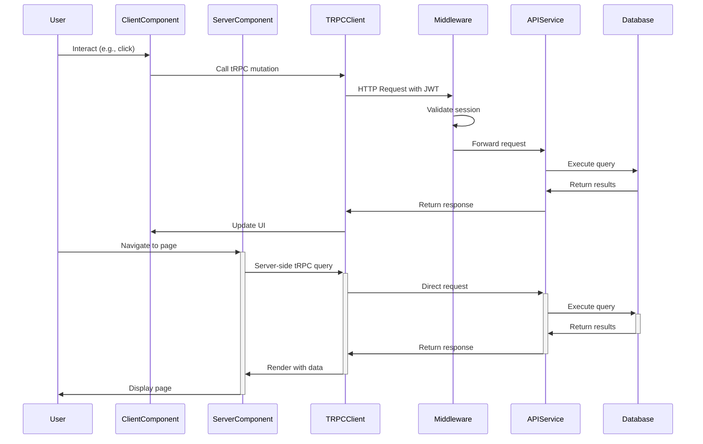
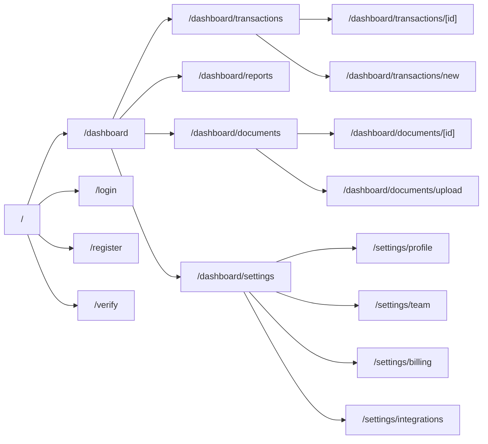
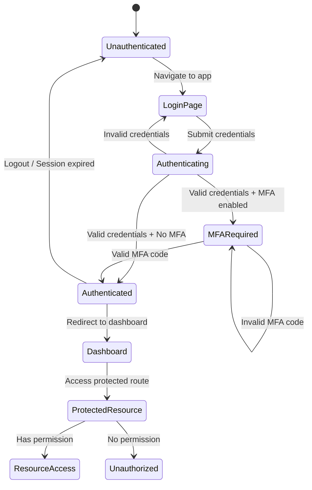

# Midday Dashboard Architecture Analysis

## 1. Architectural Philosophy and Organization Principles

The Midday dashboard application follows several key architectural principles:

### 1.1 Next.js App Router Architecture

The dashboard is built using Next.js with the App Router pattern, which provides:
- Server Components as the default rendering strategy
- Client Components where interactivity is needed
- Hybrid rendering approach that optimizes for both performance and user experience

### 1.2 Type-Safety First

The codebase prioritizes end-to-end type safety through:
- TypeScript throughout the entire application
- tRPC for type-safe API communication
- Shared types between frontend and backend

### 1.3 Component-Driven Development

UI development follows a component-driven approach with:
- Shared UI components from `@midday/ui` package
- Composition of smaller components into larger page structures
- Clear separation between presentational and container components

### 1.4 Internationalization by Default

The application is built with internationalization in mind:
- Route-based locale handling
- Internationalized routing with `next-international`
- Locale-aware components and utilities

### 1.5 Authentication and Authorization

Security is implemented through:
- Supabase Auth integration
- Middleware-based route protection
- Role-based access control
- Multi-factor authentication support

## 2. File Structure Breakdown

### 2.1 Next.js App Router Organization

```
apps/dashboard/src/
├── app/
│   ├── [locale]/           # Locale-specific routes
│   │   ├── layout.tsx      # Root layout with providers
│   │   ├── page.tsx        # Home page
│   │   ├── login/          # Authentication routes
│   │   ├── dashboard/      # Main dashboard routes
│   │   ├── settings/       # User and team settings
│   │   ├── transactions/   # Transaction management
│   │   └── ...             # Other feature routes
│   ├── api/                # API routes and handlers
│   │   ├── proxy/          # API proxying
│   │   ├── connector/      # External service connectors
│   │   └── ...             # Other API endpoints
│   └── ...                 # Global app configuration
├── components/             # Shared UI components
├── hooks/                  # Custom React hooks
├── styles/                 # Global styles
├── trpc/                   # tRPC client and server setup
│   ├── client.tsx          # Client-side tRPC configuration
│   ├── server.tsx          # Server-side tRPC configuration
│   └── query-client.ts     # React Query configuration
├── utils/                  # Utility functions
└── middleware.ts           # Next.js middleware for auth and routing
```

### 2.2 Component Hierarchy and Patterns

The dashboard follows a hierarchical component structure:

1. **Layout Components**
   - Root layout (`app/[locale]/layout.tsx`)
   - Feature-specific layouts (e.g., dashboard layout)
   - Provide consistent UI structure and shared elements

2. **Page Components**
   - Correspond to routes in the app directory
   - Compose feature-specific components
   - Handle data fetching via Server Components or tRPC

3. **Feature Components**
   - Domain-specific components for features like transactions, settings
   - Encapsulate business logic for specific features
   - Often contain their own state management

4. **Shared UI Components**
   - Reusable UI elements from `@midday/ui`
   - Custom components in `components/` directory
   - Follow consistent design patterns

### 2.3 State Management Approach

The dashboard uses a hybrid state management approach:

1. **Server State**
   - Managed through tRPC and React Query
   - Handles data fetching, caching, and synchronization
   - Provides optimistic updates and background refetching

2. **Client State**
   - React's built-in state management (useState, useReducer)
   - Context API for cross-component state sharing
   - URL state for persistent UI state (using `nuqs`)

3. **Form State**
   - Likely uses React Hook Form or similar library
   - Validation integrated with TypeScript types
   - Form submission via tRPC mutations

### 2.4 API Integration Strategy with tRPC

The dashboard integrates with the API service through tRPC:

1. **tRPC Client Setup**
   - Configured in `trpc/client.tsx` for client components
   - Server-side setup in `trpc/server.tsx` for Server Components
   - Shared query client configuration in `trpc/query-client.ts`

2. **Authentication Integration**
   - JWT tokens from Supabase Auth passed in request headers
   - Session management handled by Supabase client
   - Automatic token refresh and session persistence

3. **Data Fetching Patterns**
   - Server Components use direct tRPC calls
   - Client Components use React Query hooks
   - Optimistic updates for mutations

Example from `trpc/server.tsx`:
```typescript
export const trpc = createTRPCOptionsProxy<AppRouter>({
  queryClient: getQueryClient,
  client: createTRPCClient({
    links: [
      httpBatchLink({
        url: `${process.env.NEXT_PUBLIC_API_URL}/trpc`,
        transformer: superjson,
        async headers() {
          const supabase = await createClient();
          const { data: { session } } = await supabase.auth.getSession();
          return {
            Authorization: `Bearer ${session?.access_token}`,
            "x-user-timezone": await getTimezone(),
            "x-user-locale": await getLocale(),
            "x-user-country": await getCountryCode(),
          };
        },
      }),
    ],
  }),
});
```

### 2.5 Utility Functions and Their Purpose

The dashboard includes various utility functions:

1. **Authentication Utilities**
   - Session management
   - Permission checking
   - User profile handling

2. **Formatting Utilities**
   - Date and time formatting
   - Currency formatting
   - Number formatting with localization

3. **Data Transformation**
   - API response normalization
   - Data structure conversion
   - Entity relationship mapping

4. **Feature Detection**
   - Device type detection (e.g., `isDesktopApp()`)
   - Browser capability detection
   - Environment-specific features

### 2.6 Authentication Flow Implementation

The authentication flow is implemented through:

1. **Middleware-Based Protection**
   - `middleware.ts` checks authentication status
   - Redirects unauthenticated users to login
   - Handles MFA verification requirements

2. **Supabase Auth Integration**
   - Client-side auth in `@midday/supabase/client`
   - Server-side auth in `@midday/supabase/server`
   - Session management and token handling

3. **Protected Routes**
   - Routes requiring authentication checked in middleware
   - Role-based access control for specific features
   - Team-based permissions for multi-tenant data

Example from `middleware.ts`:
```typescript
export async function middleware(request: NextRequest) {
  const response = await updateSession(request, I18nMiddleware(request));
  const supabase = await createClient();
  const url = new URL("/", request.url);
  const nextUrl = request.nextUrl;

  // Get session
  const { data: { session } } = await supabase.auth.getSession();

  // Not authenticated - redirect to login
  if (!session && 
      newUrl.pathname !== "/login" &&
      !newUrl.pathname.includes("/i/") &&
      !newUrl.pathname.includes("/verify") &&
      !newUrl.pathname.includes("/all-done") &&
      !newUrl.pathname.includes("/desktop/search")) {
    const url = new URL("/login", request.url);
    
    if (encodedSearchParams) {
      url.searchParams.append("return_to", encodedSearchParams);
    }
    
    return NextResponse.redirect(url);
  }
  
  // Check MFA Verification if needed
  const { data: mfaData } = await supabase.auth.mfa.getAuthenticatorAssuranceLevel();
  if (mfaData &&
      mfaData.nextLevel === "aal2" &&
      mfaData.nextLevel !== mfaData.currentLevel &&
      newUrl.pathname !== "/mfa/verify") {
    const url = new URL("/mfa/verify", request.url);
    
    if (encodedSearchParams) {
      url.searchParams.append("return_to", encodedSearchParams);
    }
    
    return NextResponse.redirect(url);
  }
  
  return response;
}
```

## 3. File Tree Visualization

```
apps/dashboard/
├── public/                  # Static assets
├── src/
│   ├── app/                 # Next.js App Router
│   │   ├── [locale]/        # Internationalized routes
│   │   │   ├── layout.tsx   # Root layout
│   │   │   ├── page.tsx     # Home page
│   │   │   ├── providers.tsx # Context providers
│   │   │   ├── dashboard/   # Dashboard pages
│   │   │   ├── login/       # Authentication pages
│   │   │   ├── mfa/         # Multi-factor auth
│   │   │   ├── settings/    # User settings
│   │   │   └── ...          # Other feature pages
│   │   ├── api/             # API routes
│   │   │   ├── connector/   # External connectors
│   │   │   ├── proxy/       # API proxying
│   │   │   └── ...          # Other API endpoints
│   │   └── unauthorized.tsx # Unauthorized page
│   ├── components/          # Shared components
│   │   ├── desktop-header.tsx # Desktop app header
│   │   └── ...              # Other shared components
│   ├── hooks/               # Custom React hooks
│   │   └── ...              # Various hooks
│   ├── styles/              # Global styles
│   │   ├── globals.css      # Global CSS
│   │   └── ...              # Other styles
│   ├── trpc/                # tRPC configuration
│   │   ├── client.tsx       # Client-side setup
│   │   ├── server.tsx       # Server-side setup
│   │   └── query-client.ts  # React Query config
│   ├── utils/               # Utility functions
│   │   ├── desktop.ts       # Desktop detection
│   │   └── ...              # Other utilities
│   └── middleware.ts        # Next.js middleware
├── next.config.mjs          # Next.js configuration
├── image-loader.ts          # Custom image loader
├── tailwind.config.js       # Tailwind CSS config
└── tsconfig.json            # TypeScript config
```

## 4. Mermaid Diagrams

### 4.1 Component Relationships



### 4.2 Data Flow Patterns



### 4.3 Page Routing Structure



### 4.4 Authentication and Authorization Flow



## 5. Key Implementation Patterns

### 5.1 Server Components vs. Client Components

The dashboard makes strategic use of both Server and Client Components:

- **Server Components** (default):
  - Data fetching directly from the database or API
  - Static UI elements that don't require client-side interactivity
  - SEO-critical content

- **Client Components** (marked with "use client"):
  - Interactive UI elements requiring state
  - Forms and user inputs
  - Components using browser-only APIs

### 5.2 Internationalization Strategy

The dashboard implements internationalization through:

- Route-based locale detection (`[locale]` in the route)
- Middleware that handles locale detection and routing
- Internationalized content using `next-international`

### 5.3 Authentication Patterns

Authentication follows these patterns:

- JWT-based authentication via Supabase
- Middleware-based route protection
- MFA enforcement for sensitive operations
- Return URL preservation for post-login redirection

### 5.4 Error Handling

The application implements robust error handling:

- Global error boundaries for client-side errors
- Structured API error responses
- User-friendly error messages
- Fallback UI for error states

## 6. Conclusion

The Midday dashboard application follows modern Next.js best practices with a focus on:

- Type safety through TypeScript and tRPC
- Component-driven architecture
- Server Components for improved performance
- Clean separation of concerns
- Robust authentication and authorization
- Internationalization by default

This architecture provides a scalable foundation for the financial management platform while maintaining excellent developer experience and type safety across the stack.