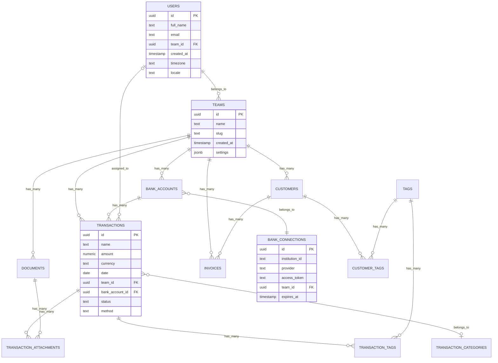

# Midday System Architecture Documentation

This document provides a comprehensive analysis of the Midday codebase system architecture, including high-level system overview, request flows, data access patterns, and middleware infrastructure.

## Table of Contents
- [Midday System Architecture Documentation](#midday-system-architecture-documentation)
  - [Table of Contents](#table-of-contents)
  - [1. High-Level System Architecture Overview](#1-high-level-system-architecture-overview)
    - [System Components Overview](#system-components-overview)
    - [Technology Stack Breakdown](#technology-stack-breakdown)
    - [Service Boundaries and Responsibilities](#service-boundaries-and-responsibilities)
      - [Dashboard Service](#dashboard-service)
      - [API Service](#api-service)
      - [Engine Service](#engine-service)
  - [2. Request Flow Analysis](#2-request-flow-analysis)
    - [User Authentication Flow](#user-authentication-flow)
    - [Transaction Data Flow](#transaction-data-flow)
    - [Document Processing Flow](#document-processing-flow)
    - [Error Handling and Recovery Flow](#error-handling-and-recovery-flow)
  - [3. Data Access Patterns](#3-data-access-patterns)
    - [Database Access Decision Tree](#database-access-decision-tree)
    - [Data Synchronization Patterns](#data-synchronization-patterns)
    - [Caching Strategy Flow](#caching-strategy-flow)
  - [4. Middleware and Infrastructure Stack](#4-middleware-and-infrastructure-stack)
    - [API Middleware Stack](#api-middleware-stack)
    - [Authentication \& Authorization Architecture](#authentication--authorization-architecture)
    - [Deployment Architecture](#deployment-architecture)
    - [Database Replication Strategy](#database-replication-strategy)
  - [5. External Service Integration Patterns](#5-external-service-integration-patterns)
    - [Banking Provider Integration](#banking-provider-integration)
    - [Provider Authentication Flow](#provider-authentication-flow)
  - [6. Database Schema and Relationships](#6-database-schema-and-relationships)
    - [Core Entity Relationships](#core-entity-relationships)
    - [Data Access Patterns by Service](#data-access-patterns-by-service)
  - [7. API Endpoint Documentation](#7-api-endpoint-documentation)
    - [tRPC Procedure Organization](#trpc-procedure-organization)
    - [REST API Structure](#rest-api-structure)
    - [Security Architecture](#security-architecture)
  - [8. Performance and Scalability Patterns](#8-performance-and-scalability-patterns)
    - [Caching Strategy by Layer](#caching-strategy-by-layer)
  - [Summary](#summary)
  - [9. Background Job Processing Architecture](#9-background-job-processing-architecture)
    - [Job Queue System Overview](#job-queue-system-overview)
    - [Job Configuration and Retry Strategies](#job-configuration-and-retry-strategies)
    - [Bank Synchronization Job Architecture](#bank-synchronization-job-architecture)
    - [Document Processing Pipeline](#document-processing-pipeline)
    - [Job Concurrency and Resource Management](#job-concurrency-and-resource-management)
    - [Scheduled Job Coordination](#scheduled-job-coordination)
  - [10. Observability and Monitoring Systems](#10-observability-and-monitoring-systems)
    - [Monitoring Architecture Overview](#monitoring-architecture-overview)
    - [Structured Logging Implementation](#structured-logging-implementation)
    - [Performance Monitoring Patterns](#performance-monitoring-patterns)
    - [Business Metrics and Analytics](#business-metrics-and-analytics)
  - [11. Financial Domain Logic](#11-financial-domain-logic)
    - [Transaction Categorization Engine](#transaction-categorization-engine)
    - [Provider-Specific Category Mapping](#provider-specific-category-mapping)
    - [Invoice Processing Workflow](#invoice-processing-workflow)
    - [Financial Calculation Engine](#financial-calculation-engine)
    - [Currency and Compliance Handling](#currency-and-compliance-handling)
  - [12. Security and Compliance Architecture](#12-security-and-compliance-architecture)
    - [Multi-Tenant Security Model](#multi-tenant-security-model)
    - [Row Level Security Implementation](#row-level-security-implementation)
    - [Data Encryption Patterns](#data-encryption-patterns)
  - [13. Real-time Systems and Event Broadcasting](#13-real-time-systems-and-event-broadcasting)
    - [Supabase Real-time Architecture](#supabase-real-time-architecture)
    - [Real-time Subscription Management](#real-time-subscription-management)
    - [Client-Side State Synchronization](#client-side-state-synchronization)
    - [Event Broadcasting Patterns](#event-broadcasting-patterns)
  - [14. Webhook Management and External Integrations](#14-webhook-management-and-external-integrations)
    - [Webhook Processing Architecture](#webhook-processing-architecture)
    - [Provider-Specific Webhook Handling](#provider-specific-webhook-handling)
    - [Signature Validation Patterns](#signature-validation-patterns)
    - [Notification System Integration](#notification-system-integration)
  - [15. Development and Deployment Workflows](#15-development-and-deployment-workflows)
    - [CI/CD Pipeline Architecture](#cicd-pipeline-architecture)
    - [Multi-Service Deployment Coordination](#multi-service-deployment-coordination)
    - [Environment Management Strategy](#environment-management-strategy)
    - [Database Migration Strategy](#database-migration-strategy)
    - [Feature Flag and Rollback Management](#feature-flag-and-rollback-management)
    - [Testing Strategy Architecture](#testing-strategy-architecture)
  - [Summary and Architecture Evolution](#summary-and-architecture-evolution)
    - [**Core Architectural Principles**](#core-architectural-principles)
    - [**Advanced System Capabilities**](#advanced-system-capabilities)
    - [**Technology Stack Excellence**](#technology-stack-excellence)
    - [**Scalability and Performance**](#scalability-and-performance)

## 1. High-Level System Architecture Overview

### System Components Overview


### Technology Stack Breakdown

| Component | Technology | Purpose | Deployment |
|-----------|------------|---------|------------|
| **Dashboard** | Next.js 14, React, TypeScript, Tailwind CSS | Main web application | Vercel |
| **API** | Node.js, tRPC, Drizzle ORM, Hono | Backend business logic | Fly.io |
| **Engine** | Cloudflare Workers, TypeScript, Hono | Financial data processing | Cloudflare |
| **Desktop** | Tauri (Rust + React) | Cross-platform desktop app | Self-contained |
| **Mobile** | Expo, React Native | Mobile application | App stores |
| **Website** | Next.js, React | Marketing website | Vercel |
| **Database** | PostgreSQL via Supabase | Primary data store | Supabase Cloud |
| **Auth** | Supabase Auth | Authentication & authorization | Supabase Cloud |
| **Storage** | Supabase Storage | File and document storage | Supabase Cloud |
| **Cache** | Redis via Upstash | Key-value caching | Upstash Cloud |

### Service Boundaries and Responsibilities

#### Dashboard Service
- **Responsibility**: User interface and experience
- **Key Features**:
  - Financial management UI
  - Document management
  - Reporting and analytics
  - Real-time data visualization
- **Communication**: tRPC calls to API, direct Supabase auth

#### API Service
- **Responsibility**: Business logic and data orchestration
- **Key Features**:
  - Dual REST/tRPC interfaces
  - Database operations via Drizzle ORM
  - Authentication middleware
  - Rate limiting and security
- **Communication**: PostgreSQL queries, Engine REST calls

#### Engine Service
- **Responsibility**: Financial data processing at the edge
- **Key Features**:
  - Bank connection management
  - Transaction processing and enrichment
  - Provider abstraction layer
  - Webhook handling
- **Communication**: External banking APIs, KV storage

## 2. Request Flow Analysis

### User Authentication Flow


### Transaction Data Flow


### Document Processing Flow


### Error Handling and Recovery Flow


## 3. Data Access Patterns

### Database Access Decision Tree


### Data Synchronization Patterns


### Caching Strategy Flow


## 4. Middleware and Infrastructure Stack

### API Middleware Stack


### Authentication & Authorization Architecture


### Deployment Architecture


### Database Replication Strategy


## 5. External Service Integration Patterns

### Banking Provider Integration


### Provider Authentication Flow


## 6. Database Schema and Relationships

### Core Entity Relationships



### Data Access Patterns by Service

| Service | Access Pattern | Use Case | Performance Considerations |
|---------|---------------|----------|---------------------------|
| **Dashboard** | tRPC Queries | Real-time UI updates | Client-side caching, optimistic updates |
| **API** | Direct DB + Replicas | Business logic operations | Read replica routing, connection pooling |
| **Engine** | KV Store + API calls | Financial data processing | Edge caching, minimal latency |
| **Background Jobs** | Primary DB only | Data consistency operations | Batch processing, transaction safety |

## 7. API Endpoint Documentation

### tRPC Procedure Organization


### REST API Structure

| Endpoint Category | Base Path | Authentication | Purpose |
|------------------|-----------|----------------|---------|
| **Public API** | `/api/v1/` | API Key | External integrations |
| **Webhooks** | `/webhooks/` | Signature validation | Provider callbacks |
| **Health** | `/health` | None | System monitoring |
| **Metrics** | `/metrics` | Internal | Performance monitoring |

### Security Architecture


## 8. Performance and Scalability Patterns

### Caching Strategy by Layer


## Summary

The Midday architecture demonstrates a modern, scalable financial management system with:

- **Microservices Architecture**: Clear separation between Dashboard, API, and Engine services
- **Multi-Provider Integration**: Abstracted banking provider layer supporting Plaid, GoCardless, EnableBanking, and Teller
- **Global Data Distribution**: Read replicas across multiple regions for optimal performance
- **Comprehensive Security**: Multi-layered authentication, authorization, and audit systems
- **Real-time Capabilities**: WebSocket connections and optimistic UI updates
- **Robust Error Handling**: Retry mechanisms, circuit breakers, and graceful degradation
- **Performance Optimization**: Multi-level caching, connection pooling, and edge computing

This architecture supports the complex requirements of financial data processing while maintaining security, performance, and scalability standards required for a production financial application.

## 9. Background Job Processing Architecture

### Job Queue System Overview

The Midday platform uses Trigger.dev as its primary background job processing system, providing reliable, scalable, and observable job execution for critical financial operations.


### Job Configuration and Retry Strategies

```typescript
// Trigger.dev Configuration
export default defineConfig({
  project: process.env.TRIGGER_PROJECT_ID!,
  runtime: "node",
  logLevel: "log",
  maxDuration: 60,
  retries: {
    enabledInDev: false,
    default: {
      maxAttempts: 3,
      minTimeoutInMs: 1000,
      maxTimeoutInMs: 10000,
      factor: 2,
      randomize: true,
    },
  },
  build: {
    external: ["sharp", "canvas"],
  },
  dirs: ["./src/tasks"],
});
```

### Bank Synchronization Job Architecture


### Document Processing Pipeline

```mermaid
flowchart TD
    A[Document Upload] --> B[process-attachment]
    B --> C{File Type?}

    C -->|HEIC| D[convert-heic]
    C -->|PDF/Image| E[OCR Processing]

    D --> E
    E --> F[classify-document]
    F --> G[classify-image]

    G --> H{Classification Result?}
    H -->|Invoice| I[Extract Invoice Data]
    H -->|Receipt| J[Extract Receipt Data]
    H -->|Other| K[General Classification]

    I --> L[match-inbox]
    J --> L
    K --> L

    L --> M{Transaction Match?}
    M -->|Found| N[Auto-attach to Transaction]
    M -->|Not Found| O[Manual Review Queue]

    N --> P[Update Status: Processed]
    O --> Q[Update Status: Pending]
```

### Job Concurrency and Resource Management

| Job Type | Concurrency Limit | Max Duration | Queue Priority | Retry Strategy |
|----------|------------------|--------------|----------------|----------------|
| **Bank Sync** | 10 per team | 120s | High | Exponential backoff |
| **Document Processing** | 100 global | 60s | Medium | Linear backoff |
| **Invoice Generation** | 50 global | 60s | Medium | Immediate retry |
| **Notifications** | 20 global | 30s | Low | No retry |
| **Data Import** | 10 global | 300s | Low | Manual retry |

### Scheduled Job Coordination

```mermaid
gantt
    title Background Job Schedule
    dateFormat HH:mm
    axisFormat %H:%M

    section Bank Operations
    Bank Sync Scheduler    :active, bank-sync, 00:00, 24:00
    Connection Health Check :health, 06:00, 18:00

    section Invoice Management
    Invoice Status Check   :invoice-status, 00:00, 12:00
    Payment Reminders     :reminders, 09:00, 17:00

    section Notifications
    Transaction Alerts    :trans-alerts, after bank-sync, 30m
    Weekly Reports       :weekly, 08:00, 09:00

    section Maintenance
    Cleanup Jobs         :cleanup, 02:00, 04:00
    Analytics Sync       :analytics, 01:00, 02:00
```

## 10. Observability and Monitoring Systems

### Monitoring Architecture Overview

```mermaid
graph TB
    subgraph "Data Sources"
        API[API Service]
        ENGINE[Engine Service]
        DASHBOARD[Dashboard]
        JOBS[Background Jobs]
        DB[Database]
    end

    subgraph "Logging Layer"
        PINO[Pino Logger<br/>Structured Logs]
        CONSOLE[Console Logger<br/>Development]
        CORRELATION[Correlation IDs<br/>Request Tracing]
    end

    subgraph "Analytics Layer"
        OPENPANEL[OpenPanel<br/>User Analytics]
        EVENTS[Event Tracking<br/>Business Metrics]
        PERFORMANCE[Performance Metrics<br/>Response Times]
    end

    subgraph "Monitoring Layer"
        ALERTS[Error Alerts<br/>Real-time]
        METRICS[System Metrics<br/>Infrastructure]
        HEALTH[Health Checks<br/>Service Status]
    end

    API --> PINO
    ENGINE --> CONSOLE
    DASHBOARD --> OPENPANEL
    JOBS --> PINO
    DB --> METRICS

    PINO --> CORRELATION
    CONSOLE --> CORRELATION

    OPENPANEL --> EVENTS
    EVENTS --> PERFORMANCE

    CORRELATION --> ALERTS
    PERFORMANCE --> ALERTS
    METRICS --> HEALTH
```

### Structured Logging Implementation

```typescript
// API Service Logging
import pino from "pino";

export const logger = pino({
  level: process.env.LOG_LEVEL || "info",
  formatters: {
    level: (label) => ({ level: label }),
  },
  timestamp: pino.stdTimeFunctions.isoTime,
});

// Usage with correlation IDs
logger.info({
  msg: "Transaction processed",
  teamId: "team_123",
  transactionId: "tx_456",
  amount: 100.50,
  currency: "USD",
  correlationId: "req_789",
  durationMs: 150,
});
```

### Performance Monitoring Patterns

```mermaid
sequenceDiagram
    participant C as Client
    participant M as Middleware
    participant BL as Business Logic
    participant DB as Database
    participant L as Logger

    C->>M: Request with trace ID
    M->>M: Start performance timer
    M->>BL: Execute business logic
    BL->>DB: Database query
    DB->>BL: Query result
    BL->>M: Response data
    M->>M: Calculate duration

    alt Duration > 500ms
        M->>L: Log slow operation warning
    end

    M->>C: Response with metrics
```

### Business Metrics and Analytics

```mermaid
graph TB
    subgraph "User Analytics"
        TRACK[Event Tracking]
        IDENTIFY[User Identification]
        CONSENT[Privacy Consent]
    end

    subgraph "Business Metrics"
        FINANCIAL[Financial KPIs]
        USAGE[Usage Metrics]
        PERFORMANCE[Performance KPIs]
    end

    subgraph "OpenPanel Integration"
        CLIENT[Client-side Tracking]
        SERVER[Server-side Events]
        DASHBOARD_ANALYTICS[Analytics Dashboard]
    end

    TRACK --> CLIENT
    IDENTIFY --> SERVER
    CONSENT --> CLIENT

    FINANCIAL --> DASHBOARD_ANALYTICS
    USAGE --> DASHBOARD_ANALYTICS
    PERFORMANCE --> DASHBOARD_ANALYTICS

    CLIENT --> DASHBOARD_ANALYTICS
    SERVER --> DASHBOARD_ANALYTICS
```

## 11. Financial Domain Logic

### Transaction Categorization Engine

The Midday platform implements a sophisticated transaction categorization system that normalizes data across multiple banking providers and applies intelligent business rules.

```mermaid
flowchart TD
    A[Raw Transaction] --> B{Banking Provider?}

    B -->|Plaid| C[Plaid Category Mapping]
    B -->|GoCardless| D[GoCardless Category Mapping]
    B -->|EnableBanking| E[EnableBanking Category Mapping]
    B -->|Teller| F[Teller Category Mapping]

    C --> G[Provider-Specific Rules]
    D --> G
    E --> G
    F --> G

    G --> H{Amount Analysis}
    H -->|Positive Amount| I[Income Categories]
    H -->|Negative Amount| J[Expense Categories]

    I --> K[Apply Business Rules]
    J --> K

    K --> L{Transaction Code Analysis}
    L -->|Bank Fees| M[Fees Category]
    L -->|Transfer| N[Transfer Category]
    L -->|Payment| O[Expense Category]

    M --> P[Final Category Assignment]
    N --> P
    O --> P

    P --> Q[Store Categorized Transaction]
```

### Provider-Specific Category Mapping

```typescript
// Plaid Category Mapping
export const mapTransactionCategory = ({ transaction, amount }) => {
  if (transaction.personal_finance_category?.primary === "INCOME") {
    return "income";
  }

  if (amount > 0) return "income";

  if (transaction.personal_finance_category?.primary === "BANK_FEES") {
    return "fees";
  }

  if (transaction.personal_finance_category?.primary === "FOOD_AND_DRINK") {
    return "meals";
  }

  if (transaction.personal_finance_category?.primary === "TRANSPORTATION") {
    return "travel";
  }

  return null; // Default to manual categorization
};

// GoCardless Category Mapping
export const mapTransactionCategory = (transaction) => {
  if (+transaction.transactionAmount.amount > 0) {
    return "income";
  }
  return null; // Simpler mapping, relies on business rules
};
```

### Invoice Processing Workflow

```mermaid
sequenceDiagram
    participant U as User
    participant D as Dashboard
    participant API as API Service
    participant CALC as Calculator
    participant PDF as PDF Generator
    participant EMAIL as Email Service
    participant DB as Database

    Note over U,DB: Invoice Creation Process
    U->>D: Create Invoice
    D->>API: Submit Invoice Data
    API->>CALC: Calculate Totals
    CALC->>CALC: Apply VAT/Tax Rules
    CALC->>API: Return Calculations
    API->>DB: Store Invoice
    API->>PDF: Generate PDF
    PDF->>API: Return PDF Buffer
    API->>EMAIL: Send Invoice Email
    EMAIL->>U: Deliver Invoice

    Note over U,DB: Payment Processing
    API->>API: Monitor Transactions
    API->>API: Match Payment
    API->>DB: Update Invoice Status
    API->>EMAIL: Send Payment Confirmation
```

### Financial Calculation Engine

```typescript
// Invoice Total Calculation
export function calculateTotal({
  lineItems,
  taxRate = 0,
  vatRate = 0,
  discount = 0,
  includeVat = true,
  includeTax = true,
}) {
  // Calculate Subtotal
  const subTotal = lineItems.reduce((acc, item) => {
    return acc + (item.price ?? 0) * (item.quantity ?? 0);
  }, 0);

  // Calculate VAT
  const totalVAT = includeVat ? (subTotal * vatRate) / 100 : 0;

  // Calculate Total before tax
  const total = subTotal + (includeVat ? totalVAT : 0) - discount;

  // Calculate tax
  const tax = includeTax ? (total * taxRate) / 100 : 0;

  return {
    subTotal,
    total: total + tax,
    vat: totalVAT,
    tax,
  };
}
```

### Currency and Compliance Handling

```mermaid
graph TB
    subgraph "Multi-Currency Support"
        DETECT[Currency Detection]
        CONVERT[Exchange Rate API]
        NORMALIZE[Normalize to Base Currency]
    end

    subgraph "Tax Compliance"
        VAT[VAT Calculation]
        TAX[Tax Rate Lookup]
        JURISDICTION[Jurisdiction Rules]
    end

    subgraph "Financial Reporting"
        CATEGORIZE[Expense Categorization]
        AGGREGATE[Financial Aggregation]
        EXPORT[Export for Accounting]
    end

    DETECT --> CONVERT
    CONVERT --> NORMALIZE

    VAT --> JURISDICTION
    TAX --> JURISDICTION

    NORMALIZE --> CATEGORIZE
    CATEGORIZE --> AGGREGATE
    AGGREGATE --> EXPORT
```

## 12. Security and Compliance Architecture

### Multi-Tenant Security Model

```mermaid
graph TB
    subgraph "Authentication Layer"
        JWT[JWT Token Validation]
        SUPABASE_AUTH[Supabase Auth Service]
        API_KEYS[API Key Management]
        SESSION[Session Management]
    end

    subgraph "Authorization Layer"
        RLS[Row Level Security]
        TEAM_ISOLATION[Team-based Isolation]
        RBAC[Role-Based Access Control]
        SCOPE_VALIDATION[API Scope Validation]
    end

    subgraph "Data Protection"
        ENCRYPTION[Data Encryption at Rest]
        TRANSIT[TLS/SSL in Transit]
        FIELD_ENCRYPTION[Sensitive Field Encryption]
        AUDIT_LOG[Audit Logging]
    end

    subgraph "Compliance"
        GDPR[GDPR Compliance]
        SOC2[SOC 2 Type II]
        DATA_RETENTION[Data Retention Policies]
        PRIVACY[Privacy Controls]
    end

    JWT --> RLS
    SUPABASE_AUTH --> TEAM_ISOLATION
    API_KEYS --> SCOPE_VALIDATION
    SESSION --> RBAC

    RLS --> ENCRYPTION
    TEAM_ISOLATION --> TRANSIT
    RBAC --> FIELD_ENCRYPTION
    SCOPE_VALIDATION --> AUDIT_LOG

    ENCRYPTION --> GDPR
    TRANSIT --> SOC2
    FIELD_ENCRYPTION --> DATA_RETENTION
    AUDIT_LOG --> PRIVACY
```

### Row Level Security Implementation

```sql
-- Team-based data isolation
CREATE POLICY "Users can only access their team's data" ON transactions
  FOR ALL USING (team_id IN (
    SELECT get_teams_for_authenticated_user()
  ));

-- User-specific access control
CREATE POLICY "Users can only access assigned transactions" ON transactions
  FOR SELECT USING (
    team_id IN (SELECT get_teams_for_authenticated_user()) AND
    (assigned_id = auth.uid() OR assigned_id IS NULL)
  );

-- API key scope validation
CREATE POLICY "API keys respect scope limitations" ON transactions
  FOR ALL USING (
    CASE
      WHEN current_setting('request.jwt.claims', true)::json->>'scope' = 'read'
      THEN false -- No write access for read-only keys
      ELSE team_id IN (SELECT get_teams_for_authenticated_user())
    END
  );
```

### Data Encryption Patterns

```mermaid
sequenceDiagram
    participant C as Client
    participant API as API Service
    participant ENC as Encryption Service
    participant DB as Database
    participant STORAGE as File Storage

    Note over C,STORAGE: Sensitive Data Handling
    C->>API: Submit sensitive data
    API->>ENC: Encrypt field-level data
    ENC->>API: Return encrypted data
    API->>DB: Store encrypted data

    Note over C,STORAGE: File Upload Security
    C->>API: Upload document
    API->>ENC: Encrypt file content
    ENC->>STORAGE: Store encrypted file
    STORAGE->>API: Return secure URL
    API->>C: Provide access token
```

## 13. Real-time Systems and Event Broadcasting

### Supabase Real-time Architecture

```mermaid
graph TB
    subgraph "Client Applications"
        WEB_CLIENT[Web Dashboard]
        DESKTOP_CLIENT[Desktop App]
        MOBILE_CLIENT[Mobile App]
    end

    subgraph "Real-time Infrastructure"
        SUPABASE_RT[Supabase Realtime]
        WEBSOCKET[WebSocket Connections]
        CHANNELS[Real-time Channels]
        FILTERS[Row-level Filters]
    end

    subgraph "Database Events"
        INSERT_EVENTS[INSERT Events]
        UPDATE_EVENTS[UPDATE Events]
        DELETE_EVENTS[DELETE Events]
        POSTGRES_CHANGES[Postgres Changes]
    end

    subgraph "Event Types"
        TRANSACTIONS[Transaction Updates]
        INBOX[Inbox Notifications]
        INVOICES[Invoice Status Changes]
        DOCUMENTS[Document Processing]
    end

    WEB_CLIENT --> WEBSOCKET
    DESKTOP_CLIENT --> WEBSOCKET
    MOBILE_CLIENT --> WEBSOCKET

    WEBSOCKET --> CHANNELS
    CHANNELS --> FILTERS

    POSTGRES_CHANGES --> INSERT_EVENTS
    POSTGRES_CHANGES --> UPDATE_EVENTS
    POSTGRES_CHANGES --> DELETE_EVENTS

    INSERT_EVENTS --> TRANSACTIONS
    UPDATE_EVENTS --> INBOX
    DELETE_EVENTS --> INVOICES
    POSTGRES_CHANGES --> DOCUMENTS

    FILTERS --> TRANSACTIONS
    FILTERS --> INBOX
    FILTERS --> INVOICES
    FILTERS --> DOCUMENTS
```

### Real-time Subscription Management

```typescript
// Real-time hook implementation
export function useRealtime<TN extends TableName>({
  channelName,
  event = "*",
  table,
  filter,
  onEvent,
}: UseRealtimeProps<TN>) {
  const supabase: SupabaseClient = createClient();

  useEffect(() => {
    const filterConfig: RealtimePostgresChangesFilter<"*"> = {
      event,
      schema: "public",
      table,
      filter, // e.g., "team_id=eq.team_123"
    };

    const channel = supabase
      .channel(channelName)
      .on("postgres_changes", filterConfig, (payload) => {
        onEvent(payload);
      })
      .subscribe();

    return () => {
      supabase.removeChannel(channel);
    };
  }, [channelName]);
}

// Usage in components
useRealtime({
  channelName: "realtime_transactions",
  table: "transactions",
  filter: `team_id=eq.${user?.teamId}`,
  onEvent: (payload) => {
    if (payload.eventType === "INSERT") {
      // Handle new transaction
      queryClient.invalidateQueries(['transactions']);
    }
  },
});
```

### Client-Side State Synchronization

```mermaid
sequenceDiagram
    participant U as User
    participant C as Client
    participant RT as Real-time Channel
    participant DB as Database
    participant QC as Query Client

    Note over U,QC: Optimistic Update Flow
    U->>C: Perform Action
    C->>QC: Optimistic Update
    C->>C: Update UI Immediately
    C->>DB: Send Mutation

    Note over U,QC: Real-time Sync
    DB->>RT: Broadcast Change
    RT->>C: Real-time Event
    C->>QC: Invalidate/Update Cache
    C->>C: Reconcile UI State

    alt Mutation Failed
        DB->>C: Error Response
        C->>QC: Rollback Optimistic Update
        C->>C: Show Error State
    end
```

### Event Broadcasting Patterns

```mermaid
flowchart TD
    A[Database Change] --> B{Event Type?}

    B -->|Transaction| C[Transaction Channel]
    B -->|Inbox| D[Inbox Channel]
    B -->|Invoice| E[Invoice Channel]
    B -->|Document| F[Document Channel]

    C --> G{Team Filter}
    D --> G
    E --> G
    F --> G

    G -->|Team A| H[Team A Clients]
    G -->|Team B| I[Team B Clients]
    G -->|Team C| J[Team C Clients]

    H --> K[Update UI]
    I --> K
    J --> K

    K --> L{Update Type?}
    L -->|Critical| M[Immediate Notification]
    L -->|Normal| N[Background Update]
    L -->|Low Priority| O[Debounced Update]
```

## 14. Webhook Management and External Integrations

### Webhook Processing Architecture

```mermaid
sequenceDiagram
    participant BP as Banking Provider
    participant CF as Cloudflare
    participant WH as Webhook Handler
    participant VAL as Validator
    participant QUEUE as Job Queue
    participant PROC as Processor
    participant DB as Database

    Note over BP,DB: Webhook Processing Flow
    BP->>CF: Send Webhook
    CF->>WH: Route to Handler
    WH->>VAL: Validate Signature
    VAL->>VAL: Verify Timestamp
    VAL->>WH: Validation Result

    alt Valid Webhook
        WH->>QUEUE: Queue Processing Job
        QUEUE->>PROC: Execute Job
        PROC->>DB: Update Data
        PROC->>WH: Job Complete
        WH->>BP: 200 OK
    else Invalid Webhook
        WH->>BP: 401 Unauthorized
    end
```

### Provider-Specific Webhook Handling

```typescript
// Plaid Webhook Handler
export async function POST(request: NextRequest) {
  const body = await request.text();
  const signature = request.headers.get("plaid-verification");

  // Validate webhook signature
  if (!validatePlaidSignature(body, signature)) {
    return NextResponse.json({ error: "Invalid signature" }, { status: 401 });
  }

  const result = plaidWebhookSchema.safeParse(JSON.parse(body));

  if (result.data.webhook_type === "TRANSACTIONS") {
    switch (result.data.webhook_code) {
      case "SYNC_UPDATES_AVAILABLE":
      case "DEFAULT_UPDATE":
      case "INITIAL_UPDATE":
      case "HISTORICAL_UPDATE": {
        await tasks.trigger("sync-connection", {
          connectionId: connectionData.id,
          manualSync: isHistoricalComplete,
        });
        break;
      }
    }
  }

  return NextResponse.json({ success: true });
}

// Teller Webhook Handler
export async function POST(request: NextRequest) {
  const body = await request.text();
  const signature = request.headers.get("teller-signature");

  if (!validateTellerSignature({ signatureHeader: signature, text: body })) {
    return NextResponse.json({ error: "Invalid signature" }, { status: 401 });
  }

  const { type } = JSON.parse(body);

  switch (type) {
    case "transactions.processed": {
      await tasks.trigger("sync-connection", {
        connectionId: connectionData.id,
        manualSync: isRecentConnection,
      });
      break;
    }
  }

  return NextResponse.json({ success: true });
}
```

### Signature Validation Patterns

```mermaid
flowchart TD
    A[Incoming Webhook] --> B[Extract Signature]
    B --> C{Provider Type?}

    C -->|Plaid| D[HMAC SHA-256]
    C -->|Teller| E[HMAC SHA-256 with Timestamp]
    C -->|GoCardless| F[Custom Validation]
    C -->|EnableBanking| G[Bearer Token]

    D --> H[Validate HMAC]
    E --> I[Validate HMAC + Timestamp]
    F --> J[Provider-specific Logic]
    G --> K[Token Verification]

    H --> L{Valid?}
    I --> L
    J --> L
    K --> L

    L -->|Yes| M[Process Webhook]
    L -->|No| N[Return 401 Error]

    M --> O[Queue Background Job]
    N --> P[Log Security Event]
```

### Notification System Integration

```mermaid
graph TB
    subgraph "Notification Triggers"
        WEBHOOK[Webhook Events]
        JOBS[Background Jobs]
        USER_ACTION[User Actions]
        SCHEDULE[Scheduled Events]
    end

    subgraph "Notification Engine (Novu)"
        ROUTER[Event Router]
        TEMPLATES[Template Engine]
        PREFERENCES[User Preferences]
        DELIVERY[Delivery Engine]
    end

    subgraph "Delivery Channels"
        EMAIL[Email (Resend)]
        IN_APP[In-App Notifications]
        SLACK[Slack Integration]
        WEBHOOK_OUT[Outbound Webhooks]
    end

    subgraph "Email System"
        REACT_EMAIL[React Email Templates]
        RESEND[Resend Service]
        TRACKING[Email Tracking]
    end

    WEBHOOK --> ROUTER
    JOBS --> ROUTER
    USER_ACTION --> ROUTER
    SCHEDULE --> ROUTER

    ROUTER --> TEMPLATES
    TEMPLATES --> PREFERENCES
    PREFERENCES --> DELIVERY

    DELIVERY --> EMAIL
    DELIVERY --> IN_APP
    DELIVERY --> SLACK
    DELIVERY --> WEBHOOK_OUT

    EMAIL --> REACT_EMAIL
    REACT_EMAIL --> RESEND
    RESEND --> TRACKING
```

## 15. Development and Deployment Workflows

### CI/CD Pipeline Architecture

```mermaid
graph TB
    subgraph "Source Control"
        GITHUB[GitHub Repository]
        BRANCHES[Feature Branches]
        MAIN[Main Branch]
        TAGS[Release Tags]
    end

    subgraph "Build Pipeline"
        TRIGGER[GitHub Actions]
        BUILD[Build Process]
        TEST[Test Suite]
        LINT[Code Quality]
    end

    subgraph "Deployment Stages"
        BETA[Beta Environment]
        STAGING[Staging Environment]
        PROD[Production Environment]
    end

    subgraph "Services Deployment"
        VERCEL[Vercel (Dashboard/Website)]
        FLY[Fly.io (API)]
        CLOUDFLARE[Cloudflare (Engine)]
        TRIGGER_JOBS[Trigger.dev (Jobs)]
    end

    subgraph "Database Management"
        MIGRATIONS[Database Migrations]
        SEEDS[Data Seeding]
        BACKUPS[Automated Backups]
    end

    GITHUB --> TRIGGER
    BRANCHES --> BUILD
    MAIN --> BUILD
    TAGS --> BUILD

    BUILD --> TEST
    TEST --> LINT
    LINT --> BETA

    BETA --> STAGING
    STAGING --> PROD

    PROD --> VERCEL
    PROD --> FLY
    PROD --> CLOUDFLARE
    PROD --> TRIGGER_JOBS

    MIGRATIONS --> VERCEL
    MIGRATIONS --> FLY
    SEEDS --> BETA
    BACKUPS --> PROD
```

### Multi-Service Deployment Coordination

```mermaid
sequenceDiagram
    participant DEV as Developer
    participant GH as GitHub
    participant GA as GitHub Actions
    participant JOBS as Trigger.dev
    participant VERCEL as Vercel
    participant FLY as Fly.io
    participant CF as Cloudflare

    Note over DEV,CF: Production Deployment Flow
    DEV->>GH: Push to main branch
    GH->>GA: Trigger workflow
    GA->>GA: Run tests & build
    GA->>JOBS: Deploy background jobs
    JOBS->>GA: Deployment complete
    GA->>VERCEL: Deploy dashboard
    VERCEL->>GA: Deployment complete
    GA->>FLY: Deploy API service
    FLY->>GA: Deployment complete
    GA->>CF: Deploy engine workers
    CF->>GA: Deployment complete
    GA->>DEV: Notify deployment success
```

### Environment Management Strategy

```typescript
// Environment Configuration
const environments = {
  development: {
    dashboard: "http://localhost:3000",
    api: "http://localhost:3001",
    engine: "http://localhost:3002",
    database: "postgresql://localhost:5432/midday_dev",
    jobs: "trigger.dev/dev",
  },
  beta: {
    dashboard: "https://beta.midday.ai",
    api: "https://api-beta.midday.ai",
    engine: "https://engine-beta.midday.ai",
    database: "postgresql://beta-db.supabase.co/postgres",
    jobs: "trigger.dev/staging",
  },
  production: {
    dashboard: "https://app.midday.ai",
    api: "https://api.midday.ai",
    engine: "https://engine.midday.ai",
    database: "postgresql://prod-db.supabase.co/postgres",
    jobs: "trigger.dev/production",
  },
};
```

### Database Migration Strategy

```mermaid
flowchart TD
    A[Schema Change] --> B{Migration Type?}

    B -->|Additive| C[Safe Migration]
    B -->|Breaking| D[Multi-Phase Migration]

    C --> E[Deploy Migration]
    E --> F[Deploy Application]

    D --> G[Phase 1: Add New Schema]
    G --> H[Deploy Dual-Write Code]
    H --> I[Migrate Existing Data]
    I --> J[Phase 2: Remove Old Schema]
    J --> K[Deploy Final Code]

    F --> L[Verify Deployment]
    K --> L

    L --> M{Success?}
    M -->|Yes| N[Complete]
    M -->|No| O[Rollback Procedure]

    O --> P[Revert Database]
    P --> Q[Revert Application]
    Q --> R[Investigate Issues]
```

### Feature Flag and Rollback Management

```mermaid
graph TB
    subgraph "Feature Management"
        FLAGS[Feature Flags]
        GRADUAL[Gradual Rollout]
        AB_TEST[A/B Testing]
        KILL_SWITCH[Kill Switch]
    end

    subgraph "Monitoring"
        METRICS[Performance Metrics]
        ERRORS[Error Rates]
        USER_FEEDBACK[User Feedback]
        BUSINESS_KPI[Business KPIs]
    end

    subgraph "Rollback Triggers"
        AUTO_ROLLBACK[Automatic Rollback]
        MANUAL_ROLLBACK[Manual Rollback]
        CIRCUIT_BREAKER[Circuit Breaker]
        HEALTH_CHECK[Health Check Failure]
    end

    FLAGS --> GRADUAL
    GRADUAL --> AB_TEST
    AB_TEST --> KILL_SWITCH

    METRICS --> AUTO_ROLLBACK
    ERRORS --> AUTO_ROLLBACK
    USER_FEEDBACK --> MANUAL_ROLLBACK
    BUSINESS_KPI --> MANUAL_ROLLBACK

    AUTO_ROLLBACK --> CIRCUIT_BREAKER
    MANUAL_ROLLBACK --> HEALTH_CHECK
```

### Testing Strategy Architecture

```mermaid
graph TB
    subgraph "Testing Pyramid"
        UNIT[Unit Tests<br/>Jest/Vitest]
        INTEGRATION[Integration Tests<br/>API Testing]
        E2E[End-to-End Tests<br/>Playwright]
        MANUAL[Manual Testing<br/>QA Process]
    end

    subgraph "Test Environments"
        LOCAL[Local Development]
        CI[CI Environment]
        STAGING_TEST[Staging Testing]
        PROD_MONITORING[Production Monitoring]
    end

    subgraph "Test Types"
        FINANCIAL[Financial Logic Tests]
        SECURITY[Security Tests]
        PERFORMANCE[Performance Tests]
        ACCESSIBILITY[Accessibility Tests]
    end

    UNIT --> LOCAL
    INTEGRATION --> CI
    E2E --> STAGING_TEST
    MANUAL --> PROD_MONITORING

    FINANCIAL --> UNIT
    SECURITY --> INTEGRATION
    PERFORMANCE --> E2E
    ACCESSIBILITY --> MANUAL
```

## Summary and Architecture Evolution

The Midday architecture represents a comprehensive, production-ready financial management platform that successfully addresses the complex requirements of modern financial applications. The system demonstrates several key architectural strengths:

### **Core Architectural Principles**

- **Microservices Design**: Clear separation of concerns across Dashboard, API, Engine, and Background Job services
- **Multi-Provider Abstraction**: Sophisticated banking provider integration supporting Plaid, GoCardless, EnableBanking, and Teller
- **Real-time Capabilities**: Comprehensive WebSocket-based real-time updates with optimistic UI patterns
- **Security-First Approach**: Multi-layered security with row-level security, encryption, and comprehensive audit logging
- **Scalable Infrastructure**: Global data distribution, intelligent caching, and edge computing optimization

### **Advanced System Capabilities**

- **Intelligent Job Processing**: Sophisticated background job orchestration with retry mechanisms, concurrency control, and dependency management
- **Financial Domain Expertise**: Advanced transaction categorization, invoice processing, and compliance handling
- **Comprehensive Observability**: Structured logging, performance monitoring, business analytics, and error tracking
- **Robust Integration Patterns**: Webhook management, signature validation, and multi-channel notification systems
- **Production-Ready Operations**: Comprehensive CI/CD pipelines, database migration strategies, and rollback procedures

### **Technology Stack Excellence**

The platform leverages modern, production-proven technologies:
- **Frontend**: Next.js 14 with React Server Components, TypeScript, and Tailwind CSS
- **Backend**: Node.js with tRPC for type-safe APIs, Drizzle ORM for database operations
- **Edge Computing**: Cloudflare Workers for financial data processing
- **Database**: PostgreSQL via Supabase with global read replicas
- **Real-time**: Supabase real-time subscriptions with WebSocket connections
- **Background Jobs**: Trigger.dev for reliable job processing
- **Monitoring**: OpenPanel analytics, structured logging, and performance tracking

### **Scalability and Performance**

The architecture supports enterprise-scale operations through:
- **Geographic Distribution**: Read replicas across Frankfurt, Virginia, and San Jose
- **Intelligent Caching**: Multi-layer caching from CDN to database query results
- **Optimized Data Access**: Smart routing between primary and replica databases
- **Efficient Job Processing**: Concurrency-controlled background job execution
- **Edge Processing**: Financial data transformation at the edge for minimal latency

This comprehensive architecture documentation serves as a complete reference for understanding, maintaining, and extending the Midday platform, providing the foundation for continued growth and evolution of the financial management system.