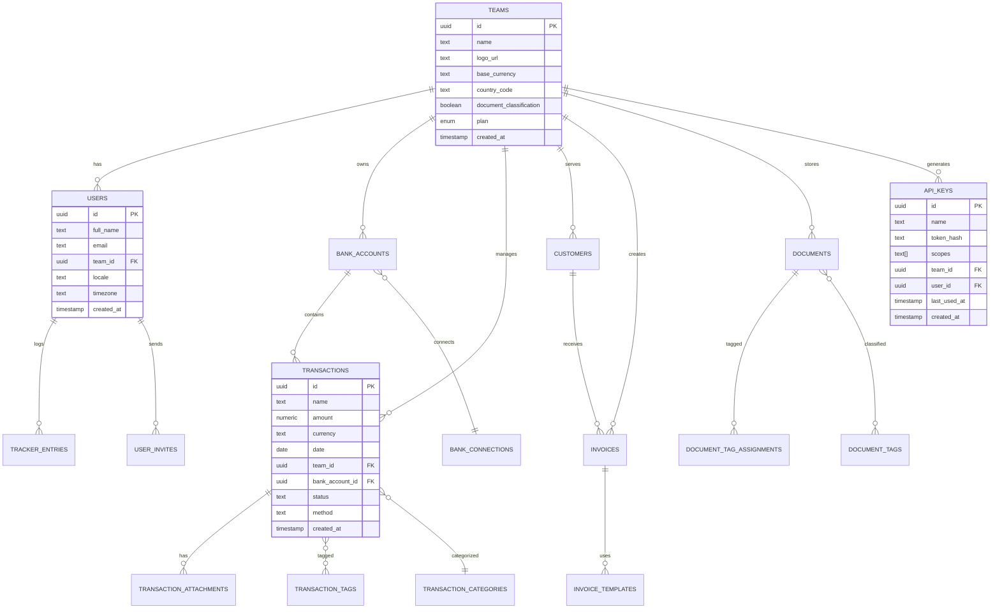

# Midday API Architecture Documentation

## Executive Summary

Midday implements a sophisticated dual-API architecture combining **tRPC** for type-safe internal communication and **REST** for external integrations. Built on the **Hono** framework with **Bun** runtime, the system leverages **Drizzle ORM** for database operations, **Supabase** for authentication and storage, and implements advanced patterns like read-after-write consistency, intelligent database routing, and comprehensive caching strategies.

### Key Architectural Decisions

- **Dual API Pattern**: tRPC for dashboard-to-API communication, REST for external integrations
- **Smart Database Routing**: Primary-replica architecture with automatic failover and replication lag handling
- **Layered Authentication**: JWT-based for tRPC, API key-based for REST endpoints
- **Comprehensive Middleware Pipeline**: Authentication, rate limiting, scope validation, and database routing
- **Type-Safe Schema Validation**: Zod schemas throughout the entire request/response cycle

## Core Architecture Analysis

### Technology Stack

| Component | Technology | Purpose | Deployment |
|-----------|------------|---------|------------|
| **Runtime** | Bun | High-performance JavaScript runtime | Fly.io |
| **Framework** | Hono | Lightweight web framework with OpenAPI support | - |
| **API Protocols** | tRPC + REST | Type-safe internal + external APIs | - |
| **Database** | PostgreSQL + Drizzle ORM | Primary data persistence with type-safe queries | Supabase |
| **Authentication** | Supabase Auth + JWT | User authentication and session management | Supabase |
| **Validation** | Zod | Runtime type validation and OpenAPI generation | - |
| **Background Jobs** | Trigger.dev | Scheduled and event-driven tasks | Trigger.dev Cloud |
| **Caching** | LRU Cache | In-memory caching for API keys and users | In-process |

### Authentication and Authorization Architecture

#### Dual Authentication Strategy

**tRPC Authentication (Internal)**
```typescript
// JWT-based authentication for dashboard communication
const session = await verifyAccessToken(accessToken);
const supabase = await createClient(accessToken);

// Context includes session, database, and geo information
type TRPCContext = {
  session: Session | null;
  supabase: SupabaseClient;
  db: Database;
  geo: ReturnType<typeof getGeoContext>;
  teamId?: string;
};
```

**REST Authentication (External)**
```typescript
// API key-based authentication for external integrations
const keyHash = hash(token);
let apiKey = apiKeyCache.get(keyHash);

if (!apiKey) {
  apiKey = await getApiKeyByToken(db, keyHash);
  if (apiKey) {
    apiKeyCache.set(keyHash, apiKey);
  }
}
```

#### Scope-Based Authorization

The system implements fine-grained permissions through scopes:

```typescript
// Scope validation middleware
export const withRequiredScope = (...requiredScopes: Scope[]) => {
  return async (c, next) => {
    const scopes = c.get("scopes") as Scope[];
    const hasRequiredScope = requiredScopes.some(scope => 
      scopes.includes(scope)
    );
    
    if (!hasRequiredScope) {
      return c.json({
        error: "Forbidden",
        description: `Required scopes: ${requiredScopes.join(", ")}`
      }, 403);
    }
    
    await next();
  };
};
```

### Database Integration Patterns

#### Smart Database Routing with Read-After-Write Consistency

The system implements sophisticated database routing to handle replication lag:

```typescript
// Primary-replica routing with mutation tracking
const cache = new LRUCache<string, number>({
  max: 5_000,
  ttl: 10000, // 10 seconds
});

const REPLICATION_LAG_WINDOW = 10000;

// Route to primary DB for recent mutations, replicas otherwise
const shouldUsePrimary = (teamId: string, operationType: string) => {
  if (operationType === "mutation") return true;
  
  const lastMutationTime = cache.get(teamId);
  if (!lastMutationTime) return false;
  
  return Date.now() - lastMutationTime < REPLICATION_LAG_WINDOW;
};
```

#### Multi-Region Database Configuration

```typescript
// Regional database connections for optimal performance
const getReplicaIndexForRegion = () => {
  switch (process.env.FLY_REGION) {
    case "fra": return 0;  // Frankfurt
    case "iad": return 1;  // Washington DC
    case "sjc": return 2;  // San Jose
    default: return 0;
  }
};

export const connectDb = async () => {
  const replicaIndex = getReplicaIndexForRegion();
  
  return withReplicas(
    primaryDb,
    [fraReplica, iadReplica, sjcReplica],
    (replicas) => replicas[replicaIndex]
  );
};
```

### Middleware Architecture and Request Flow

#### Layered Middleware Pipeline

**Protected Endpoint Middleware Stack:**
1. **Database Connection** - Establishes smart database routing
2. **Authentication** - Validates API keys and caches results
3. **Rate Limiting** - Per-user rate limiting (100 requests/10 minutes)
4. **Primary Read-After-Write** - Handles replication lag
5. **Scope Validation** - Endpoint-specific permission checks

```typescript
export const protectedMiddleware: MiddlewareHandler[] = [
  withDatabase,           // Smart DB routing
  withAuth,              // API key validation + caching
  rateLimiter({          // User-based rate limiting
    windowMs: 10 * 60 * 1000,
    limit: 100,
    keyGenerator: (c) => c.get("session")?.user?.id ?? "unknown"
  }),
  withPrimaryReadAfterWrite,  // Replication lag handling
];
```

#### Request/Response Flow with Performance Monitoring

```typescript
// Performance monitoring in middleware
const start = performance.now();
await next();
const duration = performance.now() - start;

if (duration > 500) {
  logger.warn({
    msg: "Slow DB operation detected",
    teamId,
    operationType,
    durationMs: Math.round(duration)
  });
}
```

### Error Handling Strategies

#### Structured Error Responses

```typescript
// Standardized error schemas
export const ErrorSchema = z.object({
  code: z.string().openapi({
    example: "disconnected"
  }),
  message: z.string().openapi({
    example: "Authentication required"
  })
});

// Provider-specific error mapping
export class ProviderError extends Error {
  setCode(code: string) {
    switch (code) {
      case "enrollment.disconnected":
      case "ITEM_LOGIN_REQUIRED":
        return "disconnected";
      case "ALREADY_AUTHORIZED":
        return "already_authorized";
      default:
        return "unknown";
    }
  }
}
```

#### Validation Error Handling

```typescript
// Hono default hook for validation errors
const app = new OpenAPIHono({
  defaultHook: (result, c) => {
    if (!result.success) {
      return c.json({ 
        success: false, 
        errors: result.error.errors 
      }, 422);
    }
  }
});
```

### Rate Limiting and Security

#### Multi-Layer Security Implementation

```typescript
// Security headers middleware
app.use(secureHeaders());

// CORS configuration for tRPC endpoints
app.use("/trpc/*", cors({
  origin: process.env.ALLOWED_API_ORIGINS?.split(",") ?? [],
  allowMethods: ["GET", "POST", "PUT", "DELETE", "OPTIONS", "PATCH"],
  allowHeaders: [
    "Authorization",
    "Content-Type", 
    "x-trpc-source",
    "x-user-locale",
    "x-user-timezone",
    "x-user-country"
  ],
  maxAge: 86400
}));
```

#### Intelligent Caching Strategy

```typescript
// Multi-level caching for performance
const apiKeyCache = new LRUCache<string, ApiKey>({
  max: 5_000,
  ttl: 1000 * 60 * 30  // 30 minutes
});

const userCache = new LRUCache<string, User>({
  max: 5_000,
  ttl: 1000 * 60 * 30  // 30 minutes
});

// Team permission caching
const teamPermissionCache = new LRUCache<string, boolean>({
  max: 5_000,
  ttl: 1000 * 60 * 30  // 30 minutes
});
```

## Detailed Mermaid Diagrams

### High-Level System Architecture


This diagram illustrates the multi-layered architecture where the Hono framework serves as the central API gateway, handling both tRPC and REST protocols. The middleware pipeline acts as a sophisticated traffic controller, managing authentication, rate limiting, and intelligent database routing. The service layer demonstrates the separation of concerns with dedicated services for core API logic, banking integrations, and background job processing.

### API Request/Response Flow


This sequence diagram demonstrates the sophisticated request processing pipeline. Notice how the system implements intelligent caching at the authentication layer and smart database routing based on recent mutation activity. The middleware stack processes each request through multiple validation layers, ensuring security, performance, and data consistency.

### Database Entity Relationship Diagram



The ERD reveals a team-centric data model where all business entities are scoped to teams, enabling multi-tenancy. The schema uses UUIDs for all primary keys, implements full-text search with tsvector columns, and maintains comprehensive audit trails with created_at timestamps. Notice the sophisticated relationship between transactions and their various metadata (tags, categories, attachments) enabling rich financial data analysis.

### Authentication Flow Diagram


This diagram illustrates the dual authentication strategy: JWT tokens for internal dashboard communication and API keys for external integrations. The system optimizes performance through intelligent caching while maintaining security through proper token validation and scope checking.

### Middleware Pipeline Visualization


The middleware pipeline demonstrates a sophisticated layered approach where each middleware has a specific responsibility. The system implements intelligent database routing based on mutation history, ensuring data consistency while optimizing read performance through replica usage.

### Service Layer Interactions


This diagram shows how the three main services interact: the API service handles client requests and data operations, the Engine service manages banking integrations and data enrichment, and the Jobs service orchestrates background tasks and scheduled operations. Each service maintains clear boundaries while enabling seamless data flow.

## API Endpoint Documentation

### Functional Domain Organization

The API endpoints are organized into logical functional domains, each with specific responsibilities and access patterns:

#### Financial Management Domain

**Transactions** (`/transactions`)
- **Purpose**: Core financial transaction management
- **Scope Required**: `transactions.read`, `transactions.write`
- **Key Patterns**: Cursor-based pagination, bulk operations, filtering

```typescript
// GET /transactions - List transactions with advanced filtering
app.openapi(createRoute({
  method: "get",
  path: "/",
  summary: "List all transactions",
  request: {
    query: getTransactionsSchema  // Includes cursor, sort, pageSize, filters
  },
  responses: {
    200: {
      content: { "application/json": { schema: transactionsResponseSchema } }
    }
  },
  middleware: [withRequiredScope("transactions.read")]
}));

// POST /transactions/bulk - Bulk create transactions
app.openapi(createRoute({
  method: "post",
  path: "/bulk",
  summary: "Bulk create transactions",
  request: {
    body: { content: { "application/json": { schema: createTransactionsSchema } } }
  },
  middleware: [withRequiredScope("transactions.write")]
}));
```

**Bank Accounts** (`/bank-accounts`)
- **Purpose**: Banking connection and account management
- **Scope Required**: `bank-accounts.read`, `bank-accounts.write`
- **Key Features**: Multi-provider support, balance tracking, connection status

**Metrics** (`/metrics`)
- **Purpose**: Financial analytics and reporting
- **Scope Required**: `metrics.read`
- **Key Features**: Burn rate, runway, spending analysis, revenue tracking

#### Customer Relationship Domain

**Customers** (`/customers`)
- **Purpose**: Customer and client management
- **Scope Required**: `customers.read`, `customers.write`
- **Key Features**: Full-text search, contact management, billing information

**Invoices** (`/invoices`)
- **Purpose**: Invoice generation and management
- **Scope Required**: `invoices.read`, `invoices.write`
- **Key Features**: Template-based generation, status tracking, payment integration

#### Document Management Domain

**Documents** (`/documents`)
- **Purpose**: File storage and document management
- **Scope Required**: `documents.read`, `documents.write`
- **Key Features**: Hierarchical organization, metadata extraction, full-text search

**Inbox** (`/inbox`)
- **Purpose**: Document processing and categorization
- **Scope Required**: `inbox.read`, `inbox.write`
- **Key Features**: AI-powered categorization, receipt processing, attachment handling

#### Time Tracking Domain

**Tracker Entries** (`/tracker-entries`)
- **Purpose**: Time tracking and project management
- **Scope Required**: `tracker.read`, `tracker.write`
- **Key Features**: Project association, duration tracking, reporting

**Tracker Projects** (`/tracker-projects`)
- **Purpose**: Project organization and management
- **Scope Required**: `tracker.read`, `tracker.write`
- **Key Features**: Team collaboration, budget tracking, milestone management

### Request/Response Patterns

#### Standardized Response Structure

All API responses follow consistent patterns with comprehensive OpenAPI documentation:

```typescript
// Transaction response schema with rich metadata
export const transactionResponseSchema = z.object({
  id: z.string().uuid().openapi({
    description: "Unique identifier of the transaction",
    example: "b3b7c8e2-1f2a-4c3d-9e4f-5a6b7c8d9e0f"
  }),
  name: z.string().openapi({
    description: "Name or description of the transaction",
    example: "Office Supplies Purchase"
  }),
  amount: z.number().openapi({
    description: "Monetary amount of the transaction",
    example: 150.75
  }),
  currency: z.string().openapi({
    description: "Currency code in ISO 4217 format",
    example: "USD"
  }),
  counterpartyName: z.string().nullable().openapi({
    description: "Name of the counterparty",
    example: "Spotify AB"
  }),
  // ... additional fields with comprehensive documentation
});
```

#### Pagination and Filtering Patterns

```typescript
// Cursor-based pagination for optimal performance
export const getTransactionsSchema = z.object({
  cursor: z.string().nullable().optional().openapi({
    description: "Cursor for pagination, representing the last item from previous page",
    example: "eyJpZCI6IjEyMyJ9"
  }),
  sort: z.array(z.string()).nullable().optional().openapi({
    description: "Sorting order as tuple: [field, direction]",
    example: ["date", "desc"]
  }),
  pageSize: z.coerce.number().min(1).max(10000).optional().openapi({
    description: "Number of items to return per page (1-10000)",
    example: 50
  }),
  // Advanced filtering options
  bankAccountId: z.string().uuid().optional(),
  categorySlug: z.string().optional(),
  dateRange: z.object({
    from: z.string().datetime(),
    to: z.string().datetime()
  }).optional()
});
```

#### Bulk Operations Pattern

```typescript
// Bulk operations with comprehensive validation
export const createTransactionsSchema = z.array(createTransactionSchema)
  .max(100)
  .min(1)
  .openapi({
    description: "Array of transactions to create (max 100 per request)"
  });

// Bulk response with individual operation results
export const createTransactionsResponseSchema = z.array(
  z.union([
    transactionResponseSchema,
    z.object({
      error: z.string(),
      index: z.number()
    })
  ])
);
```

### Reusable Patterns and Conventions

#### Scope-Based Authorization Pattern

```typescript
// Consistent scope validation across all endpoints
const withRequiredScope = (...requiredScopes: Scope[]) => {
  return async (c, next) => {
    const scopes = c.get("scopes") as Scope[];
    const hasRequiredScope = requiredScopes.some(scope =>
      scopes.includes(scope)
    );

    if (!hasRequiredScope) {
      return c.json({
        error: "Forbidden",
        description: `Required scopes: ${requiredScopes.join(", ")}`
      }, 403);
    }

    await next();
  };
};

// Usage in route definitions
middleware: [withRequiredScope("transactions.read")]
```

#### Response Validation Pattern

```typescript
// Consistent response validation across all endpoints
export const validateResponse = (data: any, schema: ZodSchema) => {
  const result = schema.safeParse(data);

  if (!result.success) {
    logger.error(result.error.flatten());
    return {
      success: false,
      error: "Response validation failed",
      details: result.error.flatten()
    };
  }

  return result.data;
};

// Usage in route handlers
const result = await getTransactions(db, params);
return c.json(validateResponse(result, transactionsResponseSchema));

## Implementation Details

### File Structure and Organization

The API follows a clean, domain-driven file structure that promotes maintainability and scalability:

```
apps/api/src/
├── db/                          # Database layer
│   ├── index.ts                 # Connection management
│   ├── schema.ts                # Drizzle schema definitions
│   ├── replicas.ts              # Multi-region replica handling
│   └── queries/                 # Domain-specific query functions
│       ├── transactions.ts      # Transaction operations
│       ├── customers.ts         # Customer operations
│       └── ...
├── rest/                        # REST API implementation
│   ├── middleware/              # REST-specific middleware
│   │   ├── auth.ts             # API key authentication
│   │   ├── scope.ts            # Permission validation
│   │   └── primary-read-after-write.ts
│   ├── routers/                # Domain-specific routers
│   │   ├── transactions.ts     # Transaction endpoints
│   │   ├── customers.ts        # Customer endpoints
│   │   └── index.ts            # Router aggregation
│   └── types.ts                # REST context types
├── trpc/                       # tRPC implementation
│   ├── init.ts                 # tRPC setup and context
│   ├── middleware/             # tRPC-specific middleware
│   └── routers/                # tRPC procedure definitions
├── schemas/                    # Zod validation schemas
│   ├── transactions.ts         # Transaction schemas
│   ├── customers.ts            # Customer schemas
│   └── ...
├── services/                   # External service integrations
│   └── supabase.ts            # Supabase client configuration
├── utils/                      # Utility functions
│   ├── auth.ts                # Authentication utilities
│   ├── cache/                 # Caching implementations
│   ├── logger.ts              # Logging configuration
│   └── validate-response.ts   # Response validation
└── index.ts                   # Application entry point
```

### Configuration Management

#### Environment-Specific Configuration

```typescript
// Database configuration with regional optimization
const primaryPool = postgres(process.env.DATABASE_PRIMARY_URL!, {
  prepare: false,
});

const fraPool = postgres(process.env.DATABASE_FRA_URL!, { prepare: false });
const sjcPool = postgres(process.env.DATABASE_SJC_URL!, { prepare: false });
const iadPool = postgres(process.env.DATABASE_IAD_URL!, { prepare: false });

// Regional routing based on deployment location
const getReplicaIndexForRegion = () => {
  switch (process.env.FLY_REGION) {
    case "fra": return 0;  // Frankfurt replica
    case "iad": return 1;  // Washington DC replica
    case "sjc": return 2;  // San Jose replica
    default: return 0;     // Default to Frankfurt
  }
};
```

#### OpenAPI Configuration

```typescript
// Comprehensive OpenAPI documentation setup
app.doc("/openapi", {
  openapi: "3.1.0",
  info: {
    version: "0.0.1",
    title: "Midday API",
    description: "Platform for Invoicing, Time tracking, File reconciliation, Storage, Financial Overview & AI Assistant",
    contact: {
      name: "Midday Support",
      email: "engineer@midday.ai",
      url: "https://midday.ai"
    },
    license: {
      name: "AGPL-3.0 license",
      url: "https://github.com/midday-ai/midday/blob/main/LICENSE"
    }
  },
  servers: [{ url: "https://api.midday.ai", description: "Production API" }],
  security: [{ token: [] }]
});

// Security scheme registration
app.openAPIRegistry.registerComponent("securitySchemes", "token", {
  type: "http",
  scheme: "bearer",
  description: "Default authentication mechanism",
  "x-speakeasy-example": "MIDDAY_API_KEY"
});
```

### Testing Strategies

#### Database Query Testing

```typescript
// Example test structure for database operations
describe("Transaction Queries", () => {
  let db: Database;
  let testTeamId: string;

  beforeEach(async () => {
    db = await connectDb();
    testTeamId = "test-team-id";
  });

  it("should create transaction with proper validation", async () => {
    const transactionData = {
      name: "Test Transaction",
      amount: 100.50,
      currency: "USD",
      teamId: testTeamId,
      bankAccountId: "test-account-id"
    };

    const result = await createTransaction(db, transactionData);

    expect(result.id).toBeDefined();
    expect(result.amount).toBe(100.50);
    expect(result.teamId).toBe(testTeamId);
  });

  it("should handle bulk operations correctly", async () => {
    const transactions = Array.from({ length: 50 }, (_, i) => ({
      name: `Transaction ${i}`,
      amount: i * 10,
      currency: "USD",
      teamId: testTeamId,
      bankAccountId: "test-account-id"
    }));

    const results = await createTransactions(db, { transactions });

    expect(results).toHaveLength(50);
    expect(results.every(r => r.teamId === testTeamId)).toBe(true);
  });
});
```

#### API Endpoint Testing

```typescript
// Integration testing for REST endpoints
describe("Transaction API Endpoints", () => {
  let app: Hono;
  let apiKey: string;

  beforeEach(async () => {
    app = createTestApp();
    apiKey = await createTestApiKey();
  });

  it("should list transactions with proper pagination", async () => {
    const response = await app.request("/transactions", {
      method: "GET",
      headers: { Authorization: `Bearer ${apiKey}` },
      query: { pageSize: "10", cursor: "eyJpZCI6IjEyMyJ9" }
    });

    expect(response.status).toBe(200);
    const data = await response.json();
    expect(data.data).toHaveLength(10);
    expect(data.nextCursor).toBeDefined();
  });

  it("should enforce scope validation", async () => {
    const limitedApiKey = await createTestApiKey(["transactions.read"]);

    const response = await app.request("/transactions", {
      method: "POST",
      headers: { Authorization: `Bearer ${limitedApiKey}` },
      body: JSON.stringify({ name: "Test", amount: 100 })
    });

    expect(response.status).toBe(403);
    const error = await response.json();
    expect(error.error).toBe("Forbidden");
  });
});
```

## Architectural Patterns and Best Practices

### Recurring Design Patterns

#### Repository Pattern with Query Abstraction

```typescript
// Centralized query functions with consistent error handling
export async function getTransactions(
  db: Database,
  params: GetTransactionsParams
): Promise<TransactionsResponse> {
  try {
    const { cursor, pageSize = 50, sort, filters } = params;

    let query = db
      .select()
      .from(transactions)
      .where(eq(transactions.teamId, params.teamId));

    // Apply filters dynamically
    if (filters?.bankAccountId) {
      query = query.where(eq(transactions.bankAccountId, filters.bankAccountId));
    }

    if (filters?.dateRange) {
      query = query.where(
        and(
          gte(transactions.date, filters.dateRange.from),
          lte(transactions.date, filters.dateRange.to)
        )
      );
    }

    // Apply cursor-based pagination
    if (cursor) {
      const decodedCursor = JSON.parse(atob(cursor));
      query = query.where(lt(transactions.id, decodedCursor.id));
    }

    // Apply sorting
    if (sort) {
      const [field, direction] = sort;
      query = query.orderBy(
        direction === "desc" ? desc(transactions[field]) : asc(transactions[field])
      );
    }

    const results = await query.limit(pageSize + 1);

    // Generate next cursor
    const hasMore = results.length > pageSize;
    const data = hasMore ? results.slice(0, -1) : results;
    const nextCursor = hasMore
      ? btoa(JSON.stringify({ id: data[data.length - 1].id }))
      : null;

    return { data, nextCursor, hasMore };
  } catch (error) {
    logger.error("Failed to get transactions", { error, params });
    throw new Error("Failed to retrieve transactions");
  }
}
```

#### Middleware Composition Pattern

```typescript
// Composable middleware for different endpoint types
export const createEndpointMiddleware = (options: {
  requireAuth?: boolean;
  scopes?: Scope[];
  rateLimit?: { requests: number; window: number };
  usePrimary?: boolean;
}) => {
  const middleware: MiddlewareHandler[] = [withDatabase];

  if (options.requireAuth) {
    middleware.push(withAuth);
  }

  if (options.rateLimit) {
    middleware.push(rateLimiter({
      windowMs: options.rateLimit.window,
      limit: options.rateLimit.requests,
      keyGenerator: (c) => c.get("session")?.user?.id ?? "unknown"
    }));
  }

  if (options.scopes?.length) {
    middleware.push(withRequiredScope(...options.scopes));
  }

  if (!options.usePrimary) {
    middleware.push(withPrimaryReadAfterWrite);
  }

  return middleware;
};

// Usage in route definitions
const transactionMiddleware = createEndpointMiddleware({
  requireAuth: true,
  scopes: ["transactions.read"],
  rateLimit: { requests: 100, window: 10 * 60 * 1000 }
});
```

### Design Decisions and Rationale

#### Why Dual API Architecture (tRPC + REST)?

**tRPC for Internal Communication:**
- **Type Safety**: End-to-end type safety from database to frontend
- **Developer Experience**: Auto-completion, compile-time error checking
- **Performance**: Efficient batching and caching
- **Rapid Development**: Shared types eliminate API contract mismatches

**REST for External Integration:**
- **Universal Compatibility**: Standard HTTP/JSON for third-party integrations
- **OpenAPI Documentation**: Auto-generated, comprehensive API documentation
- **Tooling Ecosystem**: Broad support for REST clients and testing tools
- **Caching**: Standard HTTP caching mechanisms

#### Why Hono Framework?

**Performance Benefits:**
- **Lightweight**: Minimal overhead compared to Express.js
- **Edge Runtime Support**: Optimized for modern deployment platforms
- **Built-in OpenAPI**: Native support for API documentation generation
- **TypeScript First**: Excellent TypeScript integration and type inference

**Developer Experience:**
- **Middleware Ecosystem**: Rich middleware ecosystem with Hono-specific optimizations
- **Validation Integration**: Seamless Zod integration for request/response validation
- **Modern Patterns**: Support for modern JavaScript features and patterns

#### Why Primary-Replica Database Architecture?

**Performance Optimization:**
- **Read Scaling**: Distribute read operations across multiple replicas
- **Geographic Distribution**: Reduce latency with region-specific replicas
- **Load Distribution**: Balance database load across multiple instances

**Consistency Guarantees:**
- **Read-After-Write**: Ensure users see their own writes immediately
- **Eventual Consistency**: Accept slight delays for non-critical reads
- **Intelligent Routing**: Automatic failover to primary for recent mutations

### Innovative Approaches

#### Smart Database Routing with Mutation Tracking

The system implements a sophisticated approach to handle read-after-write consistency:

```typescript
// Innovation: Per-team mutation tracking with LRU cache
const mutationCache = new LRUCache<string, number>({
  max: 5_000,      // Track up to 5k teams
  ttl: 10000       // 10-second replication lag window
});

// Intelligent routing decision
const shouldUsePrimary = (teamId: string, operationType: string) => {
  if (operationType === "mutation") {
    mutationCache.set(teamId, Date.now());
    return true;  // Always use primary for writes
  }

  const lastMutation = mutationCache.get(teamId);
  if (!lastMutation) return false;  // No recent mutations, use replica

  // Use primary if within replication lag window
  return Date.now() - lastMutation < REPLICATION_LAG_WINDOW;
};
```

**Benefits:**
- **Automatic Consistency**: No manual cache invalidation required
- **Performance Optimization**: Maximizes replica usage while ensuring consistency
- **Scalability**: Per-team tracking scales with business growth
- **Simplicity**: Transparent to application code

#### Multi-Level Caching Strategy

```typescript
// Innovation: Layered caching with different TTLs based on data volatility
const apiKeyCache = new LRUCache<string, ApiKey>({
  max: 5_000,
  ttl: 1000 * 60 * 30  // 30 minutes - API keys change infrequently
});

const userCache = new LRUCache<string, User>({
  max: 5_000,
  ttl: 1000 * 60 * 30  // 30 minutes - User data changes infrequently
});

const teamPermissionCache = new LRUCache<string, boolean>({
  max: 5_000,
  ttl: 1000 * 60 * 30  // 30 minutes - Permissions change infrequently
});

// Short-lived cache for high-frequency operations
const rateLimitCache = new LRUCache<string, number>({
  max: 10_000,
  ttl: 1000 * 60 * 10  // 10 minutes - Rate limit windows
});
```

#### Scope-Based Granular Permissions

```typescript
// Innovation: Hierarchical scope system with automatic expansion
const scopeHierarchy = {
  "admin": ["*"],  // Admin has all permissions
  "transactions.write": ["transactions.read"],  // Write implies read
  "invoices.write": ["invoices.read", "customers.read"],  // Cross-domain dependencies
  "metrics.read": ["transactions.read", "bank-accounts.read"]  // Composite permissions
};

export const expandScopes = (scopes: string[]): string[] => {
  const expanded = new Set(scopes);

  for (const scope of scopes) {
    const dependencies = scopeHierarchy[scope] || [];
    dependencies.forEach(dep => {
      if (dep === "*") {
        // Add all available scopes
        Object.keys(scopeHierarchy).forEach(s => expanded.add(s));
      } else {
        expanded.add(dep);
      }
    });
  }

  return Array.from(expanded);
};
```

### Cross-References and Integration Points

#### tRPC ↔ REST Integration

Both API styles share common infrastructure:
- **Shared Database Layer**: Same Drizzle queries and schemas
- **Common Authentication**: Unified session management
- **Shared Validation**: Same Zod schemas for data validation
- **Consistent Error Handling**: Standardized error responses

#### Service Boundaries

**API Service** ↔ **Engine Service**:
- REST calls for banking operations
- Shared database for transaction storage
- Event-driven communication for real-time updates

**API Service** ↔ **Jobs Service**:
- Trigger.dev integration for background tasks
- Shared database for job status tracking
- Webhook callbacks for job completion

#### External Service Integration

**Banking Providers**:
- Standardized provider interface
- Error mapping and retry logic
- Rate limiting and connection pooling

**AI Services**:
- OpenAI Gateway for transaction enrichment
- Caching for expensive AI operations
- Fallback mechanisms for service unavailability

## Conclusion

The Midday API architecture represents a sophisticated approach to building scalable, maintainable financial software. The dual API strategy (tRPC + REST) provides the best of both worlds: type-safe internal communication and universal external compatibility. The intelligent database routing, comprehensive caching strategies, and granular permission system demonstrate advanced architectural thinking that balances performance, consistency, and security.

Key takeaways for future projects:
1. **Dual API Strategy**: Consider both internal and external API needs from the start
2. **Smart Database Routing**: Implement read-after-write consistency without sacrificing performance
3. **Layered Middleware**: Build composable middleware for different endpoint requirements
4. **Comprehensive Validation**: Use schema-driven validation throughout the entire stack
5. **Intelligent Caching**: Implement multi-level caching with appropriate TTLs
6. **Granular Permissions**: Design flexible, hierarchical permission systems
7. **Observability**: Build in logging, monitoring, and performance tracking from day one

This architecture serves as an excellent foundation for building modern, scalable APIs that can grow with business requirements while maintaining high performance and developer productivity.
```
```
```
