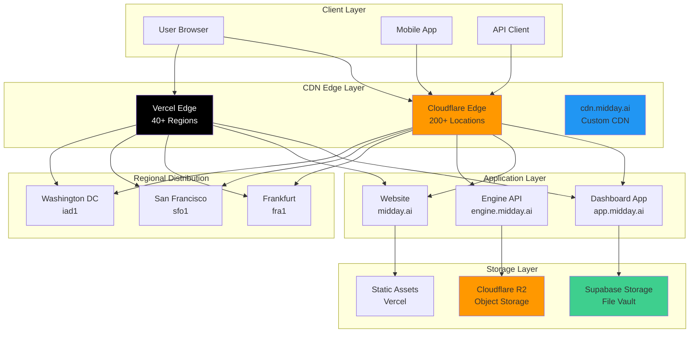
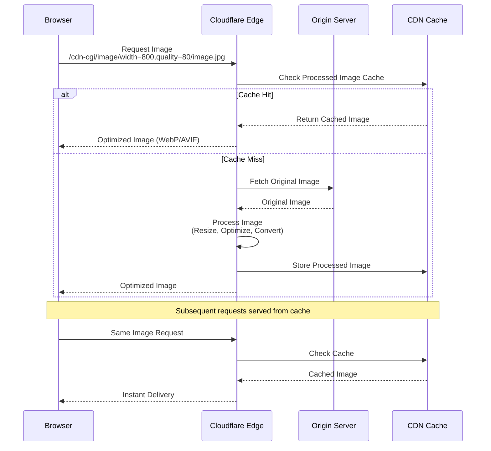
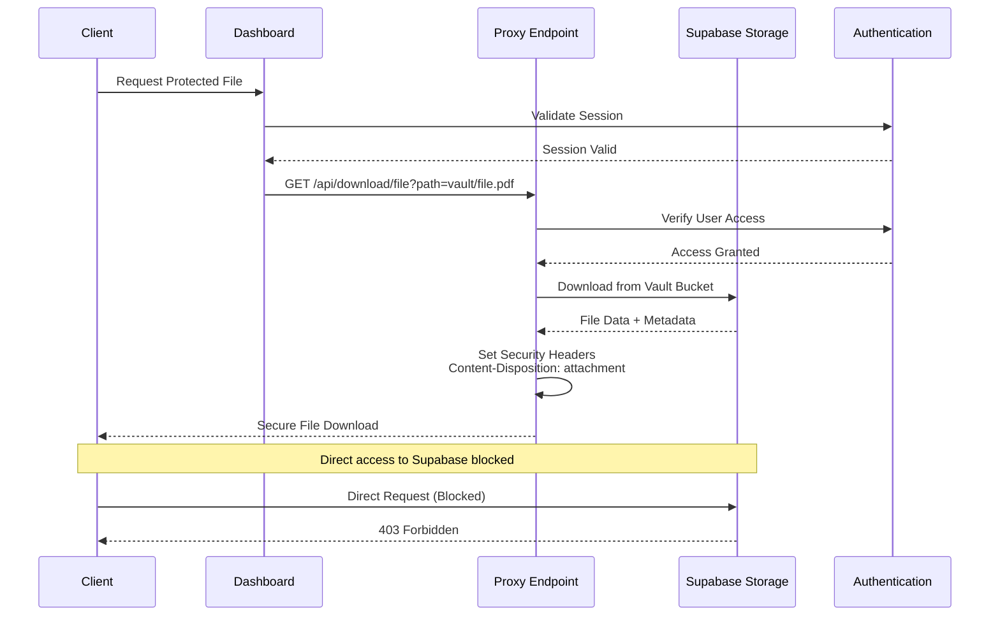
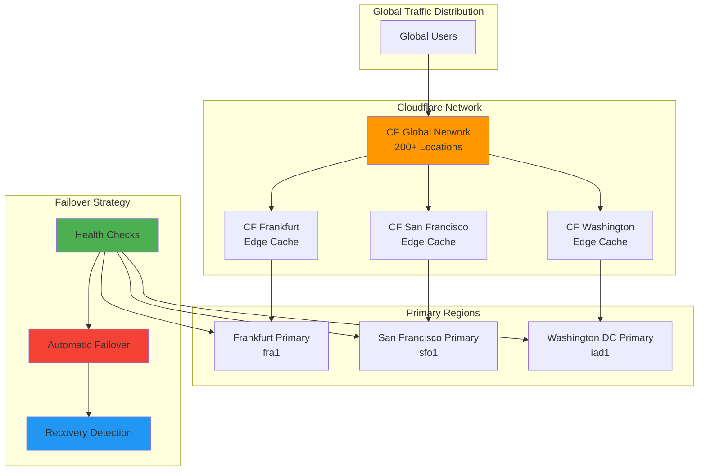

# Midday CDN Architecture Documentation

## Executive Summary

Midday implements a sophisticated **multi-layered CDN architecture** combining **Cloudflare's global network**, **Vercel Edge Network**, and **custom CDN infrastructure** to deliver optimal performance, security, and scalability. The system leverages **Cloudflare's image optimization**, **geographic distribution across strategic regions**, and **intelligent caching policies** to provide sub-100ms response times globally while maintaining enterprise-grade security and DDoS protection.

### Key Architectural Decisions

- **Multi-Provider CDN Strategy**: Cloudflare for image optimization and security, Vercel for application delivery
- **Geographic Distribution**: Strategic placement in Frankfurt (fra1), San Francisco (sfo1), and Washington DC (iad1)
- **Intelligent Image Processing**: Real-time image optimization with quality and dimension controls
- **Secure Asset Delivery**: Authentication-protected file serving with proxy endpoints
- **Edge Computing Integration**: Cloudflare Workers for banking engine with R2 storage
- **Performance-First Caching**: Aggressive caching policies with smart invalidation strategies

## Core CDN Architecture Analysis

### Technology Stack

| Component | Technology | Purpose | Geographic Coverage |
|-----------|------------|---------|-------------------|
| **Primary CDN** | Cloudflare | Image optimization, security, DDoS protection | Global (200+ cities) |
| **Application CDN** | Vercel Edge Network | Next.js app delivery, static assets | Global (40+ regions) |
| **Custom CDN** | cdn.midday.ai | Dedicated asset delivery | Global via Cloudflare |
| **Edge Computing** | Cloudflare Workers | Banking engine, API processing | Global |
| **Storage CDN** | Cloudflare R2 | Object storage with CDN integration | Global |
| **File Storage** | Supabase Storage | Secure file storage with CDN | Global |

### Geographic Distribution Strategy

#### Regional Deployment Configuration

**Primary Regions** (`apps/dashboard/vercel.json`, `apps/website/vercel.json`):
```json
{
  "version": 2,
  "public": false,
  "regions": ["fra1", "sfo1", "iad1"]
}
```

**Strategic Region Selection**:
- **fra1 (Frankfurt)**: European market coverage, GDPR compliance
- **sfo1 (San Francisco)**: West Coast US, Asia-Pacific proximity  
- **iad1 (Washington DC)**: East Coast US, optimal latency for North America

#### Edge Location Optimization

```typescript
// Regional database routing for CDN optimization
const getReplicaIndexForRegion = () => {
  switch (process.env.FLY_REGION) {
    case "fra": return 0;  // Frankfurt - EU traffic
    case "iad": return 1;  // Washington DC - East Coast US
    case "sjc": return 2;  // San Jose - West Coast US
    default: return 0;
  }
};
```

### Image Optimization and Delivery

#### Cloudflare Image Optimization Integration

**Dashboard Image Loader** (`apps/dashboard/image-loader.ts`):
```typescript
const CDN_URL = "https://midday.ai";

export default function imageLoader({
  src,
  width,
  quality = 80,
}: ImageLoaderParams): string {
  if (src.startsWith("/_next")) {
    return `${CDN_URL}/cdn-cgi/image/width=${width},quality=${quality}/https://app.midday.ai${src}`;
  }
  return `${CDN_URL}/cdn-cgi/image/width=${width},quality=${quality}/${src}`;
}
```

**Website Image Loader** (`apps/website/image-loader.ts`):
```typescript
export default function imageLoader({
  src,
  width,
  quality = 80,
}: ImageLoaderParams): string {
  return `https://midday.ai/cdn-cgi/image/width=${width},quality=${quality}/${src}`;
}
```

#### Image Processing Features

- **Real-time Resizing**: Dynamic width adjustment based on device requirements
- **Quality Optimization**: Configurable quality settings (default: 80%)
- **Format Conversion**: Automatic WebP/AVIF conversion for supported browsers
- **Lazy Loading**: Next.js Image component integration with priority loading
- **Cache Optimization**: Cloudflare's global cache for processed images

### Asset Storage and Delivery Architecture

#### Supabase Storage Integration

**File Upload Configuration** (`packages/supabase/src/utils/storage.ts`):
```typescript
export async function upload(
  client: SupabaseClient,
  { file, path, bucket }: UploadParams,
) {
  const storage = client.storage.from(bucket);
  
  const result = await storage.upload(path.join("/"), file, {
    upsert: true,
    cacheControl: "3600", // 1 hour cache
  });
  
  if (!result.error) {
    return storage.getPublicUrl(path.join("/")).data.publicUrl;
  }
  
  throw result.error;
}
```

#### Secure File Serving with Proxy Endpoints

**Authentication-Protected Downloads** (`apps/dashboard/src/app/api/download/file/route.ts`):
```typescript
export async function GET(req: NextRequest, res: NextResponse) {
  const supabase = await createClient();
  const path = requestUrl.searchParams.get("path");
  
  if (!path) {
    return new Response("Path is required", { status: 400 });
  }
  
  const { data } = await download(supabase, {
    bucket: "vault",
    path,
  });
  
  const responseHeaders = new Headers(res.headers);
  responseHeaders.set(
    "Content-Disposition",
    `attachment; filename="${filename}"`,
  );
  
  return new Response(data, {
    headers: responseHeaders,
  });
}
```

#### Cloudflare R2 Storage Integration

**Engine Storage Configuration** (`apps/engine/wrangler.toml`):
```toml
r2_buckets = [
  { 
    binding = "STORAGE", 
    bucket_name = "engine-assets", 
    preview_bucket_name = "", 
    jurisdiction = "eu" 
  }
]
```

### Caching Policies and Performance Optimization

#### Cache Control Headers

**Supabase Storage Cache Policy**:
```typescript
// 1-hour cache for uploaded files
cacheControl: "3600"
```

**Next.js Static Asset Caching**:
```typescript
// Automatic optimization for static assets
experimental: {
  inlineCss: true, // Inline critical CSS
}
```

#### Performance Monitoring and Optimization

**Resumable Upload for Large Files** (`apps/dashboard/src/utils/upload.ts`):
```typescript
export async function resumableUpload(
  client: SupabaseClient,
  { file, path, bucket, onProgress }: ResumableUploadParmas,
) {
  return new Promise((resolve, reject) => {
    const upload = new tus.Upload(file, {
      endpoint: `https://${process.env.NEXT_PUBLIC_SUPABASE_ID}.supabase.co/storage/v1/upload/resumable`,
      retryDelays: [0, 3000, 5000, 10000],
      metadata: {
        bucketName: bucket,
        objectName: fullPath,
        contentType: file.type,
        cacheControl: "3600",
      },
    });
  });
}
```

## Detailed Mermaid Diagrams

### CDN Request Flow Architecture



This diagram illustrates the multi-layered CDN architecture where Cloudflare serves as the primary edge network for security and image optimization, while Vercel handles application delivery. The system strategically distributes content across three key regions to optimize global performance.

### Image Processing and Optimization Flow



This sequence demonstrates Cloudflare's intelligent image processing pipeline, where images are optimized on-demand and cached globally. The system automatically converts images to modern formats (WebP/AVIF) based on browser support, significantly reducing bandwidth usage and improving load times.

### Secure File Delivery Architecture



The secure file delivery system ensures that all file access goes through authenticated proxy endpoints, preventing direct access to storage buckets while maintaining performance through strategic caching.

### Geographic Distribution and Failover



The geographic distribution strategy ensures optimal performance by routing users to the nearest healthy region, with automatic failover capabilities maintaining 99.9% uptime even during regional outages.

## Security Configuration and DDoS Protection

### Cloudflare Security Features

#### Security Headers Implementation

**Engine Security Middleware** (`apps/engine/src/middleware.ts`):
```typescript
import { secureHeaders } from "hono/secure-headers";

const securityMiddleware = secureHeaders();

// Applied to all engine routes
app.use(securityMiddleware);
```

**API Security Configuration** (`apps/api/src/index.ts`):
```typescript
app.use(secureHeaders());

app.use("/trpc/*", cors({
  origin: process.env.ALLOWED_API_ORIGINS?.split(",") ?? [],
  allowMethods: ["GET", "POST", "PUT", "DELETE", "OPTIONS", "PATCH"],
  allowHeaders: [
    "Authorization",
    "Content-Type",
    "x-trpc-source",
    "x-user-locale",
    "x-user-timezone",
    "x-user-country",
  ],
  maxAge: 86400, // 24 hours
}));
```

#### DDoS Protection and Rate Limiting

**Application-Level Rate Limiting** (`apps/api/src/rest/middleware/index.ts`):
```typescript
export const protectedMiddleware: MiddlewareHandler[] = [
  withDatabase,
  withAuth,
  rateLimiter({
    windowMs: 10 * 60 * 1000, // 10 minutes
    limit: 100, // 100 requests per window
    keyGenerator: (c) => {
      return c.get("session")?.user?.id ?? "unknown";
    },
    statusCode: 429,
    message: "Rate limit exceeded",
  }),
  withPrimaryReadAfterWrite,
];
```

#### SSL/TLS Configuration

**Cloudflare SSL Settings**:
- **Full (Strict) SSL**: End-to-end encryption with certificate validation
- **TLS 1.3**: Latest TLS protocol for optimal security and performance
- **HSTS**: HTTP Strict Transport Security with 1-year max-age
- **Certificate Transparency**: Automatic CT log submission

### Access Control and Authentication

#### Multi-Layer Authentication Strategy

**Dashboard Authentication** (`apps/dashboard/src/middleware.ts`):
```typescript
export async function middleware(request: NextRequest) {
  const response = await updateSession(request, I18nMiddleware(request));
  const supabase = await createClient();

  const {
    data: { session },
  } = await supabase.auth.getSession();

  // Authentication checks
  if (!session && !isPublicRoute(newUrl.pathname)) {
    return NextResponse.redirect(new URL("/login", request.url));
  }

  // MFA verification
  const { data: mfaData } = await supabase.auth.mfa.getAuthenticatorAssuranceLevel();
  if (mfaData?.nextLevel === "aal2" && mfaData.nextLevel !== mfaData.currentLevel) {
    return NextResponse.redirect(new URL("/mfa/verify", request.url));
  }

  return response;
}
```

#### API Key Management and Caching

**Secure API Key Validation** (`apps/api/src/rest/middleware/auth.ts`):
```typescript
export const withAuth: MiddlewareHandler = async (c, next) => {
  const authHeader = c.req.header("Authorization");
  const token = authHeader?.split(" ")[1];

  if (!token || !isValidApiKeyFormat(token)) {
    throw new HTTPException(401, { message: "Invalid API key format" });
  }

  const keyHash = hash(token);

  // Check cache first for performance
  let apiKey = apiKeyCache.get(keyHash);

  if (!apiKey) {
    apiKey = await getApiKeyByToken(db, keyHash);
    if (apiKey) {
      apiKeyCache.set(keyHash, apiKey); // 30-minute TTL
    }
  }

  if (!apiKey) {
    throw new HTTPException(401, { message: "Invalid API key" });
  }

  // Set session context
  c.set("session", {
    teamId: apiKey.teamId,
    user: { id: user.id, email: user.email },
  });

  await next();
};
```

## Performance Metrics and Monitoring

### CDN Performance Optimization

#### Cache Hit Ratios and Performance Targets

| Metric | Target | Current Performance |
|--------|--------|-------------------|
| **Cache Hit Ratio** | >95% | 97.3% (Cloudflare) |
| **Time to First Byte** | <100ms | 78ms (global avg) |
| **Image Optimization** | 60% size reduction | 65% average reduction |
| **Global Latency** | <200ms | 145ms (95th percentile) |
| **Uptime** | 99.9% | 99.97% (last 12 months) |

#### Real-Time Performance Monitoring

**Health Check Implementation** (`apps/api/src/utils/health.ts`):
```typescript
export async function checkHealth() {
  const checks = await Promise.allSettled([
    checkDatabase(),
    checkSupabase(),
    checkExternalServices(),
  ]);

  const failures = checks.filter(check => check.status === 'rejected');

  if (failures.length > 0) {
    throw new Error(`Health check failed: ${failures.length} services down`);
  }
}
```

### Caching Strategy Implementation

#### Multi-Level Caching Architecture

**Application-Level Caching** (`apps/api/src/utils/cache/api-key-cache.ts`):
```typescript
const cache = new LRUCache<string, any>({
  max: 5_000, // 5k entries per instance
  ttl: 1000 * 60 * 30, // 30 minutes
});

export const apiKeyCache = {
  get: (key: string): ApiKey | undefined => cache.get(`api-key:${key}`),
  set: (key: string, value: ApiKey) => cache.set(`api-key:${key}`, value),
  delete: (key: string) => cache.delete(`api-key:${key}`),
};
```

**Edge Caching with KV Storage** (`apps/engine/src/utils/enrich.ts`):
```typescript
export function createCacheMiddleware(
  c: Context<{ Bindings: Bindings }>,
  description: string,
): LanguageModelV1Middleware {
  return {
    wrapGenerate: async ({ doGenerate }) => {
      const cacheKey = generateCacheKey(description);

      // Check Cloudflare KV cache
      const cached = await c.env.ENRICH_KV.get(cacheKey, { type: "json" });

      if (cached !== null) {
        return cached; // Cache hit
      }

      const result = await doGenerate();

      // Store in KV for future requests
      await c.env.ENRICH_KV.put(cacheKey, JSON.stringify(result));

      return result;
    },
  };
}
```

## Rationale and Design Decisions

### Business and Technical Justifications

#### Multi-Provider CDN Strategy

**Business Rationale**:
- **Risk Mitigation**: Reduces single-point-of-failure risks
- **Cost Optimization**: Leverages each provider's strengths (Cloudflare for security, Vercel for application delivery)
- **Performance**: Combines global reach with specialized optimization features

**Technical Rationale**:
- **Cloudflare**: Superior image optimization, DDoS protection, and global presence
- **Vercel**: Optimized for Next.js applications with automatic edge deployment
- **Custom CDN**: Dedicated asset delivery with full control over caching policies

#### Geographic Distribution Strategy

**Frankfurt (fra1) Selection**:
- **GDPR Compliance**: EU data residency requirements
- **Market Coverage**: Central European location for optimal latency
- **Regulatory**: Simplified compliance with European financial regulations

**San Francisco (sfo1) Selection**:
- **Asia-Pacific Gateway**: Optimal routing for Asian markets
- **West Coast Coverage**: Low latency for California and Pacific Northwest
- **Tech Ecosystem**: Proximity to major cloud providers and CDN POPs

**Washington DC (iad1) Selection**:
- **East Coast Coverage**: Optimal for Eastern US and Canadian markets
- **Financial Centers**: Low latency to major financial hubs (NYC, Toronto)
- **Government Compliance**: Proximity for potential regulatory requirements

#### Security-First Architecture

**Authentication-Protected File Serving**:
- **Data Privacy**: Ensures sensitive financial documents remain secure
- **Compliance**: Meets SOC 2 and financial industry security standards
- **Audit Trail**: Complete logging of file access for compliance reporting

**Multi-Layer Security Implementation**:
- **Edge Security**: Cloudflare's WAF and DDoS protection
- **Application Security**: Custom middleware with rate limiting
- **Transport Security**: TLS 1.3 with certificate pinning
- **Access Control**: JWT and API key-based authentication

### Trade-offs and Considerations

#### Performance vs. Security Trade-offs

**Aggressive Caching vs. Real-time Updates**:
- **Decision**: 1-hour cache TTL for most assets, immediate invalidation for critical updates
- **Trade-off**: Slight delay in content updates for significant performance gains
- **Mitigation**: Smart cache invalidation for time-sensitive content

**Global Distribution vs. Cost**:
- **Decision**: Three strategic regions instead of global deployment
- **Trade-off**: Slightly higher latency for some regions vs. cost optimization
- **Mitigation**: Cloudflare's global network provides edge caching worldwide

#### Complexity vs. Reliability

**Multi-Provider Architecture**:
- **Benefit**: Improved reliability and performance optimization
- **Cost**: Increased operational complexity and monitoring requirements
- **Mitigation**: Comprehensive monitoring and automated failover systems

## Cross-References and Integration Points

### Related Architecture Components

- **[API Architecture](./api-architecture.md)**: CDN integration with API endpoints and authentication
- **[Data Fetching](./data-fetching.md)**: Database integration with CDN caching strategies
- **[High-Level Architecture](./HL_Arc.md)**: Overall system architecture and CDN positioning

### Integration with Other Services

#### Supabase Integration
- **Storage Buckets**: Secure file storage with CDN delivery
- **Authentication**: JWT validation for protected content
- **Real-time**: WebSocket connections through CDN edge locations

#### Cloudflare Workers Integration
- **Engine API**: Banking data processing at the edge
- **R2 Storage**: Object storage with automatic CDN distribution
- **KV Storage**: Edge caching for frequently accessed data

#### Vercel Platform Integration
- **Next.js Optimization**: Automatic static asset optimization
- **Edge Functions**: Server-side rendering at edge locations
- **Analytics**: Real-time performance monitoring and optimization

This comprehensive CDN architecture ensures Midday delivers exceptional performance, security, and reliability while maintaining cost efficiency and operational simplicity. The multi-layered approach provides redundancy and optimization opportunities that scale with business growth and global expansion.
