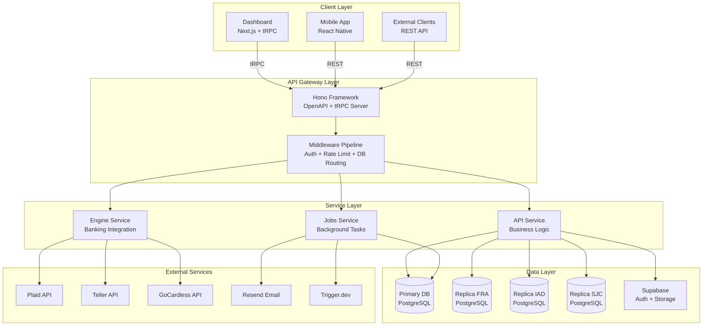
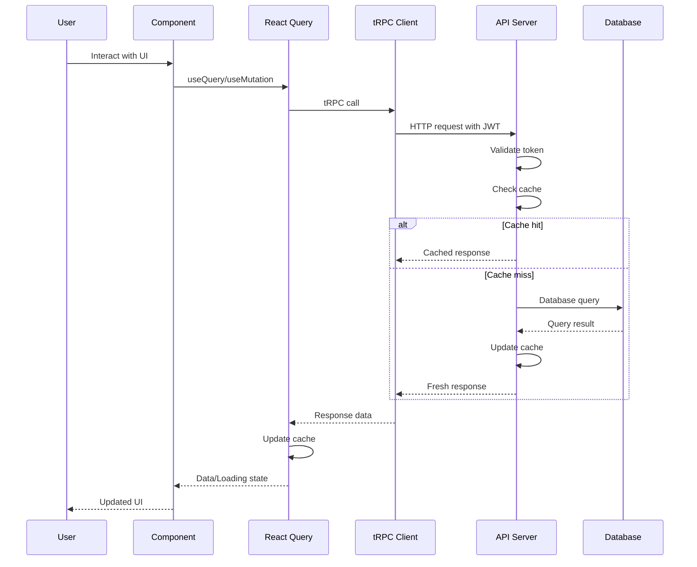
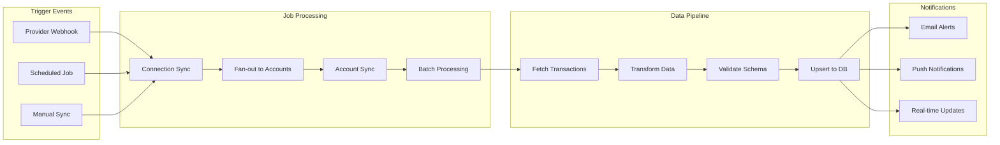
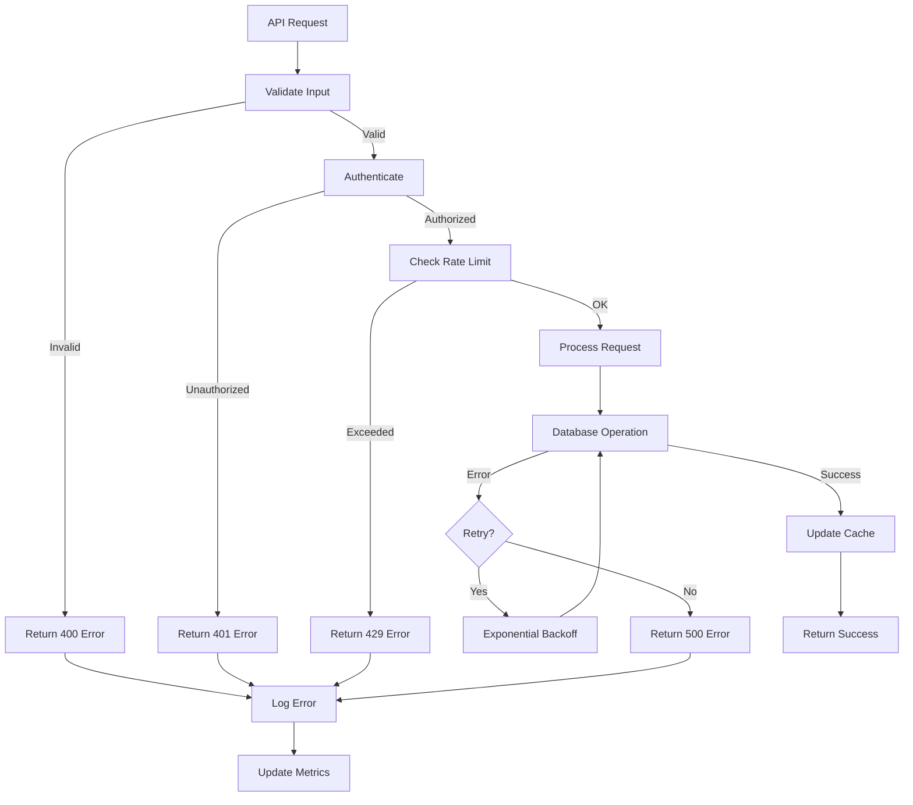

# Midday Data Fetching Architecture Documentation

## Table of Contents

1. [Executive Summary](#executive-summary)
2. [Technology Stack Overview](#technology-stack-overview)
3. [Frontend Data Fetching Patterns](#frontend-data-fetching-patterns)
4. [Backend API Architecture](#backend-api-architecture)
5. [Database Layer & Caching](#database-layer--caching)
6. [External Service Integrations](#external-service-integrations)
7. [Background Job Processing](#background-job-processing)
8. [Real-time Data Synchronization](#real-time-data-synchronization)
9. [Error Handling & Validation](#error-handling--validation)
10. [Performance Optimizations](#performance-optimizations)
11. [Security & Authentication](#security--authentication)
12. [Monitoring & Observability](#monitoring--observability)
13. [Data Flow Diagrams](#data-flow-diagrams)
14. [Implementation Examples](#implementation-examples)
15. [Cross-References](#cross-references)

## Executive Summary

Midday implements a sophisticated **multi-layered data fetching architecture** that combines modern web technologies with enterprise-grade performance optimizations. The system is built around a **dual API strategy** using tRPC for type-safe internal communication and REST for external integrations, all orchestrated through a comprehensive caching and real-time synchronization framework.

### Key Architectural Decisions

- **Dual API Architecture**: tRPC for internal dashboard communication + REST for external API access
- **Smart Database Routing**: Multi-region PostgreSQL replicas with read-after-write consistency
- **Intelligent Caching**: Multi-level LRU caching for API keys, users, and team permissions
- **Real-time Synchronization**: Supabase realtime subscriptions + background job processing
- **Type Safety**: End-to-end TypeScript with Zod validation across all layers
- **Performance First**: Prefetching, batching, and optimistic updates throughout

### Architecture Overview

| Component | Technology | Purpose | Performance Features |
|-----------|------------|---------|---------------------|
| **Frontend** | Next.js + React Query + tRPC | Dashboard & user interfaces | Prefetching, SSR hydration, optimistic updates |
| **API Gateway** | Hono + OpenAPI | Unified API layer | Request batching, response caching, rate limiting |
| **Database** | PostgreSQL + Drizzle ORM | Data persistence | Multi-region replicas, connection pooling |
| **Real-time** | Supabase + WebSockets | Live data updates | Selective subscriptions, efficient change detection |
| **Background Jobs** | Trigger.dev | Async processing | Retry mechanisms, concurrency control, scheduling |
| **Caching** | LRU Cache + React Query | Performance optimization | Multi-level caching, intelligent invalidation |

## Technology Stack Overview

### Core Technologies

**Runtime & Framework**
- **Bun**: High-performance JavaScript runtime for backend services
- **Hono**: Lightweight web framework with OpenAPI support
- **Next.js**: React framework with SSR/SSG capabilities

**Data Layer**
- **PostgreSQL**: Primary database with multi-region replicas
- **Drizzle ORM**: Type-safe database queries with automatic migrations
- **Supabase**: Authentication, real-time subscriptions, and file storage

**API & Communication**
- **tRPC**: Type-safe API layer for internal communication
- **REST**: OpenAPI-compliant endpoints for external integrations
- **React Query**: Client-side data fetching and caching

**Background Processing**
- **Trigger.dev**: Scheduled and event-driven background jobs
- **Resend**: Transactional email delivery

### File Structure Overview

```
apps/
├── api/                     # Backend API service
│   ├── src/
│   │   ├── trpc/           # tRPC router definitions
│   │   ├── rest/           # REST API endpoints
│   │   ├── db/             # Database layer
│   │   └── utils/          # Shared utilities
├── dashboard/              # Frontend dashboard
│   ├── src/
│   │   ├── trpc/          # tRPC client configuration
│   │   ├── hooks/         # Custom React hooks
│   │   └── components/    # UI components
├── engine/                 # Banking integration service
│   ├── src/
│   │   ├── providers/     # Banking provider APIs
│   │   └── routes/        # Engine API endpoints
packages/
├── jobs/                   # Background job definitions
├── supabase/              # Supabase utilities
└── ui/                    # Shared UI components
```

## Frontend Data Fetching Patterns

### tRPC + React Query Integration

The dashboard uses a sophisticated tRPC setup that provides type-safe communication with automatic caching and real-time updates.

**Client Configuration** (`apps/dashboard/src/trpc/client.tsx`):
```typescript
export function TRPCReactProvider({ children }: { children: React.ReactNode }) {
  const queryClient = getQueryClient();
  const [trpcClient] = useState(() =>
    createTRPCClient<AppRouter>({
      links: [
        httpBatchLink({
          url: `${process.env.NEXT_PUBLIC_API_URL}/trpc`,
          transformer: superjson,
          async headers() {
            const supabase = createClient();
            const { data: { session } } = await supabase.auth.getSession();
            
            return {
              Authorization: `Bearer ${session?.access_token}`,
            };
          },
        }),
        loggerLink({
          enabled: (opts) =>
            process.env.NODE_ENV === "development" ||
            (opts.direction === "down" && opts.result instanceof Error),
        }),
      ],
    }),
  );

  return (
    <QueryClientProvider client={queryClient}>
      <TRPCProvider trpcClient={trpcClient} queryClient={queryClient}>
        {children}
      </TRPCProvider>
    </QueryClientProvider>
  );
}
```

**Query Client Configuration** (`apps/dashboard/src/trpc/query-client.ts`):
```typescript
export function makeQueryClient() {
  return new QueryClient({
    defaultOptions: {
      queries: {
        staleTime: 60 * 1000, // 1 minute stale time
      },
      dehydrate: {
        serializeData: superjson.serialize,
        shouldDehydrateQuery: (query) =>
          defaultShouldDehydrateQuery(query) ||
          query.state.status === "pending",
      },
      hydrate: {
        deserializeData: superjson.deserialize,
      },
    },
  });
}
```

### Server-Side Data Fetching

**Server Components with Prefetching** (`apps/dashboard/src/trpc/server.tsx`):
```typescript
export const trpc = createTRPCOptionsProxy<AppRouter>({
  queryClient: getQueryClient,
  client: createTRPCClient({
    links: [
      httpBatchLink({
        url: `${process.env.NEXT_PUBLIC_API_URL}/trpc`,
        transformer: superjson,
        async headers() {
          const supabase = await createClient();
          const { data: { session } } = await supabase.auth.getSession();
          
          return {
            Authorization: `Bearer ${session?.access_token}`,
            "x-user-timezone": await getTimezone(),
            "x-user-locale": await getLocale(),
            "x-user-country": await getCountryCode(),
          };
        },
      }),
    ],
  }),
});

// Batch prefetching utility
export function batchPrefetch<T extends ReturnType<TRPCQueryOptions<any>>>(
  queryOptionsArray: T[],
) {
  const queryClient = getQueryClient();
  
  for (const queryOptions of queryOptionsArray) {
    if (queryOptions.queryKey[1]?.type === "infinite") {
      void queryClient.prefetchInfiniteQuery(queryOptions as any);
    } else {
      void queryClient.prefetchQuery(queryOptions);
    }
  }
}
```

### Custom Hooks for Data Management

**User Data Hook** (`apps/dashboard/src/hooks/use-user.ts`):
```typescript
export function useUserQuery() {
  const trpc = useTRPC();
  return useSuspenseQuery(trpc.user.me.queryOptions());
}

export function useUserMutation() {
  const trpc = useTRPC();
  const queryClient = useQueryClient();
  
  return useMutation({
    ...trpc.user.update.mutationOptions(),
    onSuccess: () => {
      queryClient.invalidateQueries({ queryKey: ["user"] });
    },
  });
}
```

### URL State Management

**Query Parameter Synchronization** (`apps/dashboard/src/hooks/use-connect-params.ts`):
```typescript
export function useConnectParams(initialCountryCode?: string) {
  const [params, setParams] = useQueryStates({
    step: parseAsStringLiteral(["connect", "account"]),
    countryCode: parseAsString.withDefault(initialCountryCode ?? ""),
    provider: parseAsStringLiteral([
      "teller", "plaid", "gocardless", "enablebanking"
    ]),
    token: parseAsString,
    enrollment_id: parseAsString,
    institution_id: parseAsString,
    search: parseAsString.withDefault("").withOptions({ clearOnDefault: true }),
  });

  return { ...params, setParams };
}
```

## Backend API Architecture

### Dual API Strategy

Midday implements a sophisticated dual API approach that serves different use cases:

1. **tRPC for Internal Communication**: Type-safe, high-performance communication between dashboard and API
2. **REST for External Integrations**: OpenAPI-compliant endpoints for third-party access

### tRPC Router Architecture

**Main Router** (`apps/api/src/trpc/routers/_app.ts`):
```typescript
export const appRouter = createTRPCRouter({
  apps: appsRouter,
  bankAccounts: bankAccountsRouter,
  bankConnections: bankConnectionsRouter,
  customers: customersRouter,
  documents: documentsRouter,
  inbox: inboxRouter,
  institutions: institutionsRouter,
  invoice: invoiceRouter,
  metrics: metricsRouter,
  tags: tagsRouter,
  team: teamRouter,
  transactions: transactionsRouter,
  user: userRouter,
});
```

**Context Creation** (`apps/api/src/trpc/init.ts`):
```typescript
export const createTRPCContext = async (
  _: unknown,
  c: Context,
): Promise<TRPCContext> => {
  const accessToken = c.req.header("Authorization")?.split(" ")[1];
  const session = await verifyAccessToken(accessToken);
  const supabase = await createClient(accessToken);
  const db = await connectDb();
  const geo = getGeoContext(c.req);

  return {
    session,
    supabase,
    db,
    geo,
  };
};
```

**Protected Procedures with Middleware**:
```typescript
export const protectedProcedure = t.procedure
  .use(withTeamPermissionMiddleware)
  .use(withPrimaryDbMiddleware)
  .use(async (opts) => {
    const { teamId, session } = opts.ctx;

    if (!session) {
      throw new TRPCError({ code: "UNAUTHORIZED" });
    }

    return opts.next({
      ctx: { teamId, session },
    });
  });
```

### REST API Implementation

**Router Structure** (`apps/api/src/rest/routers/index.ts`):
```typescript
const routers = new OpenAPIHono();

routers.use(...protectedMiddleware);

routers.route("/transactions", transactionsRouter);
routers.route("/teams", teamsRouter);
routers.route("/users", usersRouter);
routers.route("/customers", customersRouter);
routers.route("/bank-accounts", bankAccountsRouter);
routers.route("/documents", documentsRouter);
routers.route("/invoices", invoicesRouter);
routers.route("/metrics", metricsRouter);
```

**Middleware Pipeline**:
```typescript
export const protectedMiddleware: MiddlewareHandler[] = [
  withDatabase,           // Smart DB routing
  withAuth,              // API key validation + caching
  rateLimiter({          // User-based rate limiting
    windowMs: 10 * 60 * 1000,
    limit: 100,
    keyGenerator: (c) => c.get("session")?.user?.id ?? "unknown"
  }),
  withPrimaryReadAfterWrite,  // Replication lag handling
];
```

## Database Layer & Caching

### Multi-Region Database Architecture

**Connection Management** (`apps/api/src/db/index.ts`):
```typescript
const primaryPool = postgres(process.env.DATABASE_PRIMARY_URL!, {
  prepare: false,
});

const fraPool = postgres(process.env.DATABASE_FRA_URL!, { prepare: false });
const sjcPool = postgres(process.env.DATABASE_SJC_URL!, { prepare: false });
const iadPool = postgres(process.env.DATABASE_IAD_URL!, { prepare: false });

export const connectDb = async () => {
  const replicaIndex = getReplicaIndexForRegion();

  return withReplicas(
    primaryDb,
    [
      drizzle(fraPool, { schema, casing: "snake_case" }),
      drizzle(iadPool, { schema, casing: "snake_case" }),
      drizzle(sjcPool, { schema, casing: "snake_case" }),
    ],
    (replicas) => replicas[replicaIndex]!,
  );
};
```

### Read-After-Write Consistency

**Smart Database Routing** (`apps/api/src/trpc/middleware/primary-read-after-write.ts`):
```typescript
const cache = new LRUCache<string, number>({
  max: 5_000, // up to 5k entries
  ttl: 10000, // 10 seconds in milliseconds
});

const REPLICATION_LAG_WINDOW = 10000;

export const withPrimaryReadAfterWrite = async <TReturn>(opts: {
  ctx: { session?: Session | null; teamId?: string | null; db: Database };
  type: "query" | "mutation" | "subscription";
  next: (opts: { ctx: any }) => Promise<TReturn>;
}) => {
  const { ctx, type, next } = opts;
  const teamId = ctx.teamId;

  if (teamId) {
    if (type === "mutation") {
      // Set timestamp when team can use replicas again
      const expiryTime = Date.now() + REPLICATION_LAG_WINDOW;
      cache.set(teamId, expiryTime);

      // Force primary DB usage
      const dbWithPrimary = ctx.db as DatabaseWithPrimary;
      if (dbWithPrimary.usePrimaryOnly) {
        ctx.db = dbWithPrimary.usePrimaryOnly();
      }
    } else if (type === "query") {
      const timestamp = cache.get(teamId);
      const now = Date.now();

      // Use primary if recent mutation detected
      if (timestamp && now < timestamp) {
        const dbWithPrimary = ctx.db as DatabaseWithPrimary;
        if (dbWithPrimary.usePrimaryOnly) {
          ctx.db = dbWithPrimary.usePrimaryOnly();
        }
      }
    }
  }

  return next(opts);
};
```

### Multi-Level Caching Strategy

**API Key Caching** (`apps/api/src/utils/cache/api-key-cache.ts`):
```typescript
const cache = new LRUCache<string, any>({
  max: 5_000, // up to 5k entries
  ttl: 1000 * 60 * 30, // 30 minutes
});

export const apiKeyCache = {
  get: (key: string): ApiKey | undefined => cache.get(`api-key:${key}`),
  set: (key: string, value: ApiKey) => cache.set(`api-key:${key}`, value),
  delete: (key: string) => cache.delete(`api-key:${key}`),
};
```

**User Caching** (`apps/api/src/utils/cache/user-cache.ts`):
```typescript
export const cache = new LRUCache<string, any>({
  max: 5_000,
  ttl: 1000 * 60 * 30, // 30 minutes
});

export const userCache = {
  get: (key: string) => cache.get(`user:${key}`),
  set: (key: string, value: any) => cache.set(`user:${key}`, value),
  delete: (key: string) => cache.delete(`user:${key}`),
};
```

**Team Permission Caching** (`apps/api/src/trpc/middleware/team-permission.ts`):
```typescript
const cache = new LRUCache<string, boolean>({
  max: 5_000,
  ttl: 1000 * 60 * 30, // 30 minutes
});
```

## External Service Integrations

### Banking Provider Architecture

Midday integrates with multiple banking providers through a unified provider interface:

**Provider Interface** (`apps/engine/src/providers/types.ts`):
```typescript
export interface Provider {
  getTransactions(params: GetTransactionsRequest): Promise<Transaction[]>;
  getAccounts(params: GetAccountsRequest): Promise<Account[]>;
  getInstitutions(params: GetInstitutionsRequest): Promise<Institution[]>;
  getHealthCheck(): Promise<HealthStatus>;
}
```

**Plaid Integration** (`apps/engine/src/providers/plaid/plaid-api.ts`):
```typescript
export class PlaidApi {
  #client: PlaidBaseApi;

  constructor(params: ProviderParams) {
    const configuration = new Configuration({
      basePath: PlaidEnvironments[params.envs.PLAID_ENVIRONMENT],
      baseOptions: {
        headers: {
          "PLAID-CLIENT-ID": params.envs.PLAID_CLIENT_ID,
          "PLAID-SECRET": params.envs.PLAID_SECRET,
        },
      },
    });

    this.#client = new PlaidBaseApi(configuration);
  }

  async getTransactions({ accessToken, accountId, latest }: GetTransactionsRequest) {
    return withRetry(async () => {
      const response = await this.#client.transactionsGet({
        access_token: accessToken,
        start_date: latest ? subDays(new Date(), 30) : subYears(new Date(), 2),
        end_date: new Date(),
        account_ids: [accountId],
        count: 500,
      });

      return response.data.transactions;
    });
  }
}
```

**Error Handling for Providers** (`apps/engine/src/utils/error.ts`):
```typescript
export class ProviderError extends Error {
  code: string;

  constructor({ message, code }: { message: string; code: string }) {
    super(message);
    this.code = this.setCode(code);
  }

  setCode(code: string) {
    switch (code) {
      // Teller
      case "enrollment.disconnected":
      case "enrollment.disconnected.user_action.mfa_required":
      // Plaid
      case "ITEM_LOGIN_REQUIRED":
      case "ITEM_LOCKED":
      // GoCardless
      case "AccessExpiredError":
      case "AccountInactiveError":
        return "disconnected";
      default:
        return "unknown";
    }
  }
}
```

### Webhook Processing

**Plaid Webhook Handler** (`apps/dashboard/src/app/api/webhook/plaid/route.ts`):
```typescript
export async function POST(req: NextRequest) {
  const clientIp = req.headers.get("x-forwarded-for") || "";

  if (!ALLOWED_IPS.includes(clientIp)) {
    return NextResponse.json(
      { error: "Unauthorized IP address" },
      { status: 403 }
    );
  }

  const body = await req.json();
  const result = webhookSchema.safeParse(body);

  if (!result.success) {
    return NextResponse.json(
      { error: "Invalid webhook payload" },
      { status: 400 }
    );
  }

  const supabase = await createClient({ admin: true });
  const { data: connectionData } = await supabase
    .from("bank_connections")
    .select("id, created_at")
    .eq("reference_id", result.data.item_id)
    .single();

  if (result.data.webhook_type === "TRANSACTIONS") {
    switch (result.data.webhook_code) {
      case "SYNC_UPDATES_AVAILABLE":
      case "DEFAULT_UPDATE":
      case "INITIAL_UPDATE":
      case "HISTORICAL_UPDATE": {
        await tasks.trigger("sync-connection", {
          connectionId: connectionData.id,
          manualSync: result.data.webhook_code === "HISTORICAL_UPDATE",
        });
        break;
      }
    }
  }

  return NextResponse.json({ success: true });
}
```

## Background Job Processing

### Trigger.dev Configuration

**Job Configuration** (`packages/jobs/trigger.config.ts`):
```typescript
export default defineConfig({
  project: process.env.TRIGGER_PROJECT_ID!,
  runtime: "node",
  logLevel: "log",
  maxDuration: 60,
  retries: {
    enabledInDev: false,
    default: {
      maxAttempts: 3,
      minTimeoutInMs: 1000,
      maxTimeoutInMs: 10000,
      factor: 2,
      randomize: true,
    },
  },
  build: {
    external: ["sharp", "canvas"],
  },
  dirs: ["./src/tasks"],
});
```

### Bank Synchronization Jobs

**Connection Sync (Fan-out Pattern)** (`packages/jobs/src/tasks/bank/sync/connection.ts`):
```typescript
export const syncConnection = schemaTask({
  id: "sync-connection",
  maxDuration: 120,
  retry: {
    maxAttempts: 2,
  },
  schema: syncConnectionSchema,
  run: async ({ connectionId, manualSync }, { ctx }) => {
    const supabase = createClient();

    const { data: connection } = await supabase
      .from("bank_connections")
      .select("*, bank_accounts(*)")
      .eq("id", connectionId)
      .single();

    if (!connection) {
      throw new Error(`Connection ${connectionId} not found`);
    }

    // Fan-out to individual account sync jobs
    const accountJobs = connection.bank_accounts.map(account => ({
      connectionId,
      accountId: account.id,
      manualSync,
    }));

    await triggerSequenceAndWait(accountJobs, syncAccount);

    // Trigger notifications after sync
    await transactionNotifications.trigger({
      teamId: connection.team_id,
    });
  },
});
```

**Account Sync with Concurrency Control** (`packages/jobs/src/tasks/bank/sync/account.ts`):
```typescript
export const syncAccount = schemaTask({
  id: "sync-account",
  maxDuration: 300,
  queue: {
    concurrencyLimit: 10,
  },
  machine: {
    preset: "medium-1x",
  },
  schema: syncAccountSchema,
  run: async ({ connectionId, accountId, manualSync }) => {
    const supabase = createClient();

    // Get latest transactions from provider
    const response = await client.transactions.list({
      connectionId,
      accountId,
      latest: !manualSync,
    });

    if (!response.data) {
      throw new Error("Failed to fetch transactions");
    }

    // Process transactions in batches
    await processBatch(response.data, async (batch) => {
      await supabase.from("transactions").upsert(batch);
    });
  },
});
```

### Scheduled Jobs

**Invoice Scheduler** (`packages/jobs/src/tasks/invoice/scheduler/schedule-invoice.ts`):
```typescript
export const invoiceScheduler = schedules.task({
  id: "invoice-scheduler",
  cron: "0 0,12 * * *", // Twice daily
  run: async () => {
    if (process.env.TRIGGER_ENVIRONMENT !== "production") return;

    const supabase = createClient();

    const { data: invoices } = await supabase
      .from("invoices")
      .select("id")
      .in("status", ["unpaid", "overdue"]);

    if (!invoices) return;

    const formattedInvoices = invoices.map((invoice) => ({
      invoiceId: invoice.id,
    }));

    await triggerBatch(formattedInvoices, checkInvoiceStatus);
  },
});
```

## Real-time Data Synchronization

### Supabase Realtime Integration

**Real-time Hook** (`apps/dashboard/src/hooks/use-realtime.ts`):
```typescript
export function useRealtime<TN extends TableName>({
  channelName,
  event = "*",
  table,
  filter,
  onEvent,
}: UseRealtimeProps<TN>) {
  const supabase: SupabaseClient = createClient();

  useEffect(() => {
    const filterConfig: RealtimePostgresChangesFilter<"*"> = {
      event,
      schema: "public",
      table,
      filter,
    };

    const channel = supabase
      .channel(channelName)
      .on(
        "postgres_changes",
        filterConfig,
        (payload: RealtimePostgresChangesPayload<Tables[TN]["Row"]>) => {
          onEvent(payload);
        },
      )
      .subscribe();

    return () => {
      supabase.removeChannel(channel);
    };
  }, [channelName]);
}
```

**Job Status Monitoring** (`apps/dashboard/src/hooks/use-sync-status.ts`):
```typescript
export function useSyncStatus({
  runId: initialRunId,
  accessToken: initialAccessToken,
}: UseSyncStatusProps) {
  const [accessToken, setAccessToken] = useState<string | undefined>(
    initialAccessToken,
  );
  const [runId, setRunId] = useState<string | undefined>(initialRunId);
  const [status, setStatus] = useState<
    "FAILED" | "SYNCING" | "COMPLETED" | null
  >(null);

  const { run, error } = useRealtimeRun(runId, {
    enabled: !!runId && !!accessToken,
    accessToken,
  });

  useEffect(() => {
    if (run?.status) {
      setStatus(run.status);
    }
  }, [run]);

  return { status, error };
}
```

### Notification System Integration

**Novu Integration** (`apps/dashboard/src/hooks/use-notifications.ts`):
```typescript
export function useNotifications() {
  const [notifications, setNotifications] = useState<any[]>([]);
  const [isLoading, setIsLoading] = useState(true);
  const headlessServiceRef = useRef<HeadlessService | null>(null);
  const { data: user } = useUserQuery();

  const fetchNotifications = useCallback(async () => {
    if (!headlessServiceRef.current) return;

    try {
      const { data } = await headlessServiceRef.current.fetchNotifications({
        page: 0,
        limit: 10,
      });

      setNotifications(data || []);
    } catch (error) {
      console.error("Failed to fetch notifications:", error);
    } finally {
      setIsLoading(false);
    }
  }, []);

  useEffect(() => {
    const subscriberId = `${user?.teamId}_${user?.id}`;

    if (subscriberId && !headlessServiceRef.current) {
      const headlessService = new HeadlessService({
        applicationIdentifier: process.env.NEXT_PUBLIC_NOVU_APPLICATION_IDENTIFIER!,
        subscriberId,
      });

      headlessService.initializeSession({
        listener: () => {},
        onSuccess: () => {
          headlessServiceRef.current = headlessService;
          fetchNotifications();
        },
        onError: () => {},
      });
    }
  }, [fetchNotifications, user]);

  return {
    isLoading,
    notifications,
    hasUnseenNotifications: notifications.some(
      (notification) => !notification.seen,
    ),
  };
}
```

## Error Handling & Validation

### Zod Schema Validation

**Transaction Schema** (`packages/import/src/validate.ts`):
```typescript
export const createTransactionSchema = z.object({
  name: z.string(),
  currency: z.string(),
  bank_account_id: z.string(),
  team_id: z.string(),
  internal_id: z.string(),
  status: z.enum(["posted", "pending"]),
  method: z.enum(["card", "bank", "other"]),
  date: z.coerce.date(),
  amount: z.number(),
  manual: z.boolean(),
  category_slug: z.string().nullable(),
});
```

**Response Validation Utility** (`apps/api/src/utils/validate-response.ts`):
```typescript
export const validateResponse = (data: any, schema: ZodSchema) => {
  const result = schema.safeParse(data);

  if (!result.success) {
    const cause = result.error.flatten();
    logger.error(cause);

    return {
      success: false,
      error: "Response validation failed",
      details: cause,
      data: null,
    };
  }

  return result.data;
};
```

### tRPC Error Handling

**Custom Error Types** (`apps/api/src/trpc/init.ts`):
```typescript
export const protectedProcedure = t.procedure
  .use(withTeamPermissionMiddleware)
  .use(withPrimaryDbMiddleware)
  .use(async (opts) => {
    const { teamId, session } = opts.ctx;

    if (!session) {
      throw new TRPCError({ code: "UNAUTHORIZED" });
    }

    return opts.next({
      ctx: { teamId, session },
    });
  });
```

### Safe Action Client

**Form Action Error Handling** (`apps/dashboard/src/actions/safe-action.ts`):
```typescript
export const actionClient = createSafeActionClient({
  handleServerError(e) {
    if (e instanceof Error) {
      return e.message;
    }
    return DEFAULT_SERVER_ERROR_MESSAGE;
  },
});

export const authActionClient = actionClientWithMeta
  .use(async ({ next, clientInput, metadata }) => {
    const result = await next({ ctx: {} });

    if (process.env.NODE_ENV === "development") {
      logger("Input ->", clientInput);
      logger("Result ->", result.data);
      logger("Metadata ->", metadata);
    }

    return result;
  });
```

## Data Flow Diagrams

### High-Level Data Flow Architecture



### Frontend Data Fetching Flow



### Banking Data Synchronization Flow



### Error Handling and Retry Flow



## Performance Optimizations

### Database Query Optimization

**Efficient Query Patterns** (`apps/api/src/db/queries/transactions.ts`):
```typescript
export async function getTransactions(
  db: Database,
  params: GetTransactionsParams,
) {
  const { teamId, limit = 50, offset = 0, sort, filters } = params;

  // Build dynamic where conditions
  const conditions: SQL[] = [eq(transactions.teamId, teamId)];

  if (filters?.dateRange) {
    conditions.push(
      gte(transactions.date, filters.dateRange.from),
      lte(transactions.date, filters.dateRange.to)
    );
  }

  if (filters?.categories?.length) {
    conditions.push(inArray(transactions.categorySlug, filters.categories));
  }

  // Optimized query with joins and pagination
  return db.query.transactions.findMany({
    where: and(...conditions),
    limit,
    offset,
    orderBy: sort?.map(s =>
      s.direction === "desc"
        ? desc(transactions[s.field])
        : asc(transactions[s.field])
    ),
    with: {
      category: {
        columns: { name: true, color: true }
      },
      bankAccount: {
        columns: { name: true, currency: true }
      },
      attachments: {
        columns: { id: true, name: true, size: true }
      }
    }
  });
}
```

### Prefetching Strategies

**Layout-Level Prefetching** (`apps/dashboard/src/app/[locale]/(app)/(sidebar)/layout.tsx`):
```typescript
export default async function Layout({ children }: { children: React.ReactNode }) {
  const queryClient = getQueryClient();

  // Batch prefetch critical data
  batchPrefetch([
    trpc.team.current.queryOptions(),
    trpc.invoice.defaultSettings.queryOptions(),
    trpc.search.global.queryOptions({ searchTerm: "" }),
  ]);

  // Fetch user data with suspense
  const user = await queryClient.fetchQuery(trpc.user.me.queryOptions());

  if (!user) redirect("/login");
  if (!user.fullName) redirect("/setup");
  if (!user.teamId) redirect("/teams");

  return (
    <HydrateClient>
      <div className="flex h-screen">
        <Sidebar />
        <main className="flex-1 overflow-hidden">
          {children}
        </main>
      </div>
    </HydrateClient>
  );
}
```

### Optimistic Updates

**Transaction Updates** (`apps/dashboard/src/components/transaction-details.tsx`):
```typescript
export function TransactionDetails() {
  const trpc = useTRPC();
  const { transactionId } = useTransactionParams();
  const queryClient = useQueryClient();

  const { data, isLoading } = useQuery({
    ...trpc.transactions.getById.queryOptions({ id: transactionId! }),
    enabled: Boolean(transactionId),
    staleTime: 60 * 1000,
    initialData: () => {
      // Try to get data from list cache
      const listData = queryClient.getQueryData(
        trpc.transactions.list.queryKey()
      );
      return listData?.find(t => t.id === transactionId);
    },
  });

  const updateMutation = useMutation({
    ...trpc.transactions.update.mutationOptions(),
    onMutate: async (variables) => {
      // Cancel outgoing refetches
      await queryClient.cancelQueries({
        queryKey: trpc.transactions.getById.queryKey({ id: transactionId! })
      });

      // Snapshot previous value
      const previousData = queryClient.getQueryData(
        trpc.transactions.getById.queryKey({ id: transactionId! })
      );

      // Optimistically update
      queryClient.setQueryData(
        trpc.transactions.getById.queryKey({ id: transactionId! }),
        (old) => ({ ...old, ...variables })
      );

      return { previousData };
    },
    onError: (err, variables, context) => {
      // Rollback on error
      if (context?.previousData) {
        queryClient.setQueryData(
          trpc.transactions.getById.queryKey({ id: transactionId! }),
          context.previousData
        );
      }
    },
    onSettled: () => {
      // Refetch to ensure consistency
      queryClient.invalidateQueries({
        queryKey: trpc.transactions.getById.queryKey({ id: transactionId! })
      });
    },
  });

  return (
    <div>
      {/* Transaction UI */}
    </div>
  );
}
```

## Security & Authentication

### JWT Token Management

**Token Validation** (`apps/api/src/utils/auth.ts`):
```typescript
export async function verifyAccessToken(token?: string): Promise<Session | null> {
  if (!token) return null;

  try {
    const supabase = createClient();
    const { data: { user }, error } = await supabase.auth.getUser(token);

    if (error || !user) return null;

    return {
      user: {
        id: user.id,
        email: user.email!,
        teamId: user.user_metadata?.team_id,
      },
      accessToken: token,
    };
  } catch (error) {
    logger.error("Token verification failed", error);
    return null;
  }
}
```

**API Key Authentication** (`apps/api/src/rest/middleware/auth.ts`):
```typescript
export const withAuth: MiddlewareHandler = async (c, next) => {
  const authorization = c.req.header("Authorization");

  if (!authorization?.startsWith("Bearer ")) {
    return c.json({ error: "Missing or invalid authorization header" }, 401);
  }

  const apiKey = authorization.split(" ")[1];

  // Check cache first
  let cachedApiKey = apiKeyCache.get(apiKey);

  if (!cachedApiKey) {
    // Fetch from database
    const db = c.get("db");
    cachedApiKey = await getApiKeyByKey(db, apiKey);

    if (cachedApiKey) {
      apiKeyCache.set(apiKey, cachedApiKey);
    }
  }

  if (!cachedApiKey || !cachedApiKey.enabled) {
    return c.json({ error: "Invalid or disabled API key" }, 401);
  }

  // Set session context
  c.set("session", {
    user: {
      id: cachedApiKey.userId,
      teamId: cachedApiKey.teamId,
    },
    apiKey: cachedApiKey,
  });

  await next();
};
```

### Rate Limiting

**User-Based Rate Limiting** (`apps/api/src/rest/middleware/rate-limit.ts`):
```typescript
export const rateLimiter = (options: {
  windowMs: number;
  limit: number;
  keyGenerator: (c: Context) => string;
}) => {
  const requests = new Map<string, { count: number; resetTime: number }>();

  return async (c: Context, next: Next) => {
    const key = options.keyGenerator(c);
    const now = Date.now();
    const windowStart = now - options.windowMs;

    // Clean up old entries
    for (const [k, v] of requests.entries()) {
      if (v.resetTime < windowStart) {
        requests.delete(k);
      }
    }

    const current = requests.get(key) || { count: 0, resetTime: now + options.windowMs };

    if (current.count >= options.limit && current.resetTime > now) {
      return c.json(
        {
          error: "Rate limit exceeded",
          retryAfter: Math.ceil((current.resetTime - now) / 1000)
        },
        429
      );
    }

    current.count++;
    requests.set(key, current);

    await next();
  };
};
```

## Monitoring & Observability

### Health Check Implementation

**Service Health Monitoring** (`apps/engine/src/routes/health/index.ts`):
```typescript
export default app.openapi(
  createRoute({
    method: "get",
    path: "/",
    summary: "Health Check",
    responses: {
      200: {
        content: { "application/json": { schema: HealthSchema } },
        description: "Service health status",
      },
    },
  }),
  async (c) => {
    const envs = env(c);
    const api = new Provider();

    // Check all provider health
    const providers = await api.getHealthCheck({
      kv: c.env.KV,
      fetcher: c.env.TELLER_CERT,
      envs,
    });

    const search = await getHealthCheck(envs);

    const allServices = { ...providers, search };
    const isHealthy = Object.values(allServices).every(
      (service) => service.healthy,
    );

    if (isHealthy) {
      return c.json({ data: allServices }, 200);
    }

    return c.json(
      { message: "Service unhealthy", code: "bad_request" },
      400,
    );
  },
);
```

### Performance Monitoring

**Slow Query Detection** (`apps/api/src/rest/middleware/primary-read-after-write.ts`):
```typescript
export const withPrimaryReadAfterWrite: MiddlewareHandler = async (c, next) => {
  // ... routing logic ...

  const start = performance.now();
  await next();
  const duration = performance.now() - start;

  if (duration > 500) {
    logger.warn({
      msg: "Slow DB operation detected",
      teamId,
      operationType,
      method: c.req.method,
      path: c.req.path,
      durationMs: Math.round(duration),
    });
  }
};
```

### Structured Logging

**Logger Configuration** (`apps/api/src/utils/logger.ts`):
```typescript
export const logger = pino({
  level: process.env.LOG_LEVEL || "info",
  formatters: {
    level: (label) => ({ level: label }),
  },
  timestamp: pino.stdTimeFunctions.isoTime,
  redact: {
    paths: ["req.headers.authorization", "*.password", "*.token"],
    censor: "[REDACTED]",
  },
});
```

## Cross-References

### Related Documentation

- **[API Architecture](./api-architecture.md)**: Detailed API implementation patterns
- **[High-Level Architecture](./HL_Arc.md)**: System overview and component relationships
- **[Dashboard Architecture](../learning/dashboard-architecture.md)**: Frontend implementation details

### Key Implementation Files

**Frontend Data Fetching**:
- `apps/dashboard/src/trpc/client.tsx` - tRPC client configuration
- `apps/dashboard/src/trpc/server.tsx` - Server-side tRPC setup
- `apps/dashboard/src/hooks/use-*.ts` - Custom data fetching hooks

**Backend API Layer**:
- `apps/api/src/trpc/routers/_app.ts` - Main tRPC router
- `apps/api/src/rest/routers/` - REST API endpoints
- `apps/api/src/db/queries/` - Database query functions

**External Integrations**:
- `apps/engine/src/providers/` - Banking provider implementations
- `packages/jobs/src/tasks/` - Background job definitions
- `apps/dashboard/src/app/api/webhook/` - Webhook handlers

**Performance & Caching**:
- `apps/api/src/utils/cache/` - Caching utilities
- `apps/api/src/trpc/middleware/primary-read-after-write.ts` - Database routing
- `apps/dashboard/src/trpc/query-client.ts` - React Query configuration

This comprehensive documentation provides a complete overview of Midday's data fetching architecture, from high-level patterns to specific implementation details, ensuring developers can understand and contribute to the system effectively.
```
