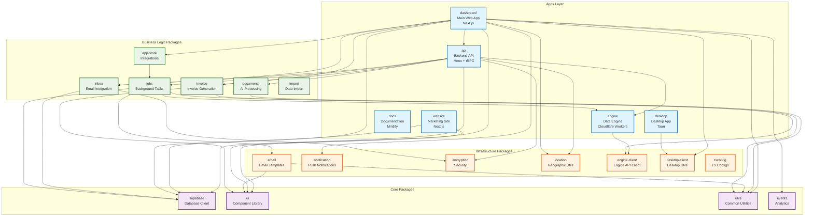
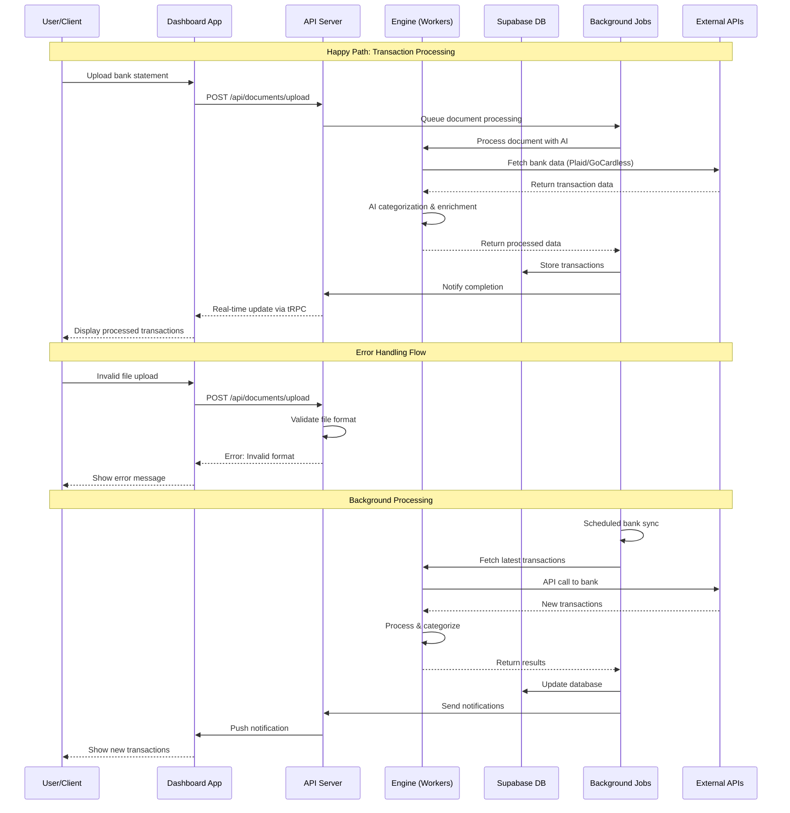
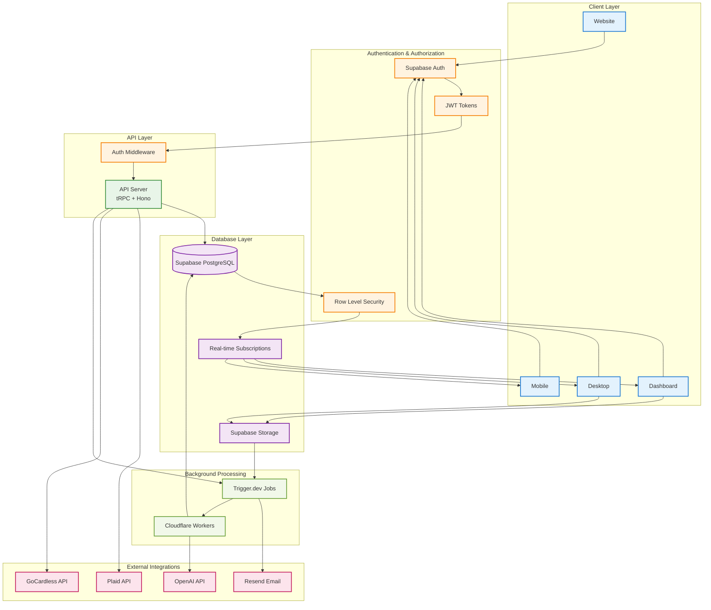

# Midday Monorepo Package Architecture

## Executive Summary

Midday is a comprehensive financial management platform built as a modern monorepo using Turborepo, Bun, and TypeScript. The architecture follows a clean separation of concerns with 6 applications and 17 shared packages, enabling scalable development and deployment across web, desktop, and cloud environments.

### Key Architectural Decisions
- **Monorepo Management**: Turborepo with Bun package manager for optimal build performance
- **Technology Stack**: Next.js, Hono, Cloudflare Workers, Tauri, Supabase
- **Code Quality**: Biome for linting/formatting, TypeScript for type safety
- **Deployment**: Multi-environment support (development, staging, production)

### High-Level Structure
```
midday/
├── apps/           # 6 applications
│   ├── api/        # Backend API (Hono + tRPC)
│   ├── dashboard/  # Main web application (Next.js)
│   ├── desktop/    # Desktop application (Tauri)
│   ├── docs/       # Documentation site (Mintlify)
│   ├── engine/     # Data processing engine (Cloudflare Workers)
│   └── website/    # Marketing website (Next.js)
└── packages/       # 17 shared packages
    ├── app-store/  # Third-party integrations
    ├── documents/  # AI document processing
    ├── email/      # Email templates and rendering
    ├── encryption/ # Security utilities
    ├── events/     # Analytics and tracking
    ├── inbox/      # Email integration
    ├── invoice/    # Invoice generation
    ├── jobs/       # Background processing
    ├── location/   # Geographic utilities
    ├── notification/ # Push notifications
    ├── supabase/   # Database client
    ├── ui/         # Shared components
    └── utils/      # Common utilities
```

## Package Inventory

### Applications

#### @midday/api
- **Location**: `apps/api/`
- **Purpose**: Backend API server providing tRPC endpoints and REST APIs
- **Technology**: Hono, tRPC, Drizzle ORM, Bun runtime
- **Port**: 3003
- **Key Dependencies**:
  - Internal: `@midday/documents`, `@midday/encryption`, `@midday/engine`, `@midday/inbox`, `@midday/invoice`, `@midday/jobs`, `@midday/location`, `@midday/supabase`
  - External: `hono`, `@trpc/server`, `drizzle-orm`, `@ai-sdk/openai`, `resend`
- **Main Exports**: `./trpc/routers/_app`
- **Responsibilities**:
  - API endpoint management
  - Database operations via Drizzle ORM
  - Authentication and authorization
  - Integration with external services (OpenAI, Resend, etc.)
  - Rate limiting and security

#### @midday/dashboard
- **Location**: `apps/dashboard/`
- **Purpose**: Main web application for financial management
- **Technology**: Next.js 15, React 19, Tailwind CSS
- **Port**: 3001
- **Key Dependencies**:
  - Internal: All shared packages except `@midday/desktop-client`
  - External: `next`, `react`, `@tanstack/react-query`, `framer-motion`, `recharts`
- **Responsibilities**:
  - User interface for financial data
  - Real-time data visualization
  - Invoice management
  - Bank integrations
  - File uploads and document processing
  - Multi-language support

#### @midday/desktop
- **Location**: `apps/desktop/`
- **Purpose**: Cross-platform desktop application
- **Technology**: Tauri, React, Vite
- **Key Dependencies**:
  - External: `@tauri-apps/api`, `react`, `vite`
- **Responsibilities**:
  - Native desktop experience
  - Deep system integration
  - Offline capabilities
  - Auto-updates
  - Global shortcuts and system tray

#### @midday/docs
- **Location**: `apps/docs/`
- **Purpose**: Documentation website
- **Technology**: Mintlify
- **Port**: 3004
- **Responsibilities**:
  - API documentation
  - User guides
  - Developer documentation
  - OpenAPI specification generation

#### @midday/engine
- **Location**: `apps/engine/`
- **Purpose**: Data processing and AI engine
- **Technology**: Cloudflare Workers, Hono
- **Port**: 3002
- **Key Dependencies**:
  - External: `hono`, `plaid`, `typesense`, `workers-ai-provider`
- **Main Exports**: `.`, `./gocardless/utils`
- **Responsibilities**:
  - Bank data processing
  - AI-powered categorization
  - Search functionality
  - External API integrations (Plaid, GoCardless)
  - Edge computing optimizations

#### @midday/website
- **Location**: `apps/website/`
- **Purpose**: Marketing and landing pages
- **Technology**: Next.js 15, React 19
- **Port**: 3000
- **Key Dependencies**:
  - Internal: `@midday/supabase`, `@midday/ui`
  - External: `next`, `react`, `framer-motion`, `next-mdx-remote`
- **Responsibilities**:
  - Marketing content
  - Blog and documentation
  - Lead generation
  - SEO optimization

### Shared Packages

#### @midday/app-store
- **Location**: `packages/app-store/`
- **Purpose**: Third-party application integrations
- **Key Dependencies**: `@slack/bolt`, `@ai-sdk/openai`, `@midday/jobs`
- **Main Exports**: `.`, `./slack`, `./slack-notifications`, `./slack-client`, `./db`
- **Integrations**:
  - Slack (notifications, bot)
  - Raycast (time tracking)
  - QuickBooks (accounting)
  - Xero (bookkeeping)
  - Cal.com (scheduling)
  - Fortnox (accounting)
  - Visma (ERP)
  - Zapier (automation)

#### @midday/documents
- **Location**: `packages/documents/`
- **Purpose**: AI-powered document processing and classification
- **Key Dependencies**: `@langchain/community`, `@mistralai/mistralai`, `mammoth`, `unpdf`
- **Main Exports**: `.`, `./loader`, `./classifier`, `./embed`, `./utils`
- **Capabilities**:
  - PDF, Word, Excel document parsing
  - AI-powered document classification
  - Text embedding and search
  - Receipt and invoice extraction

#### @midday/email
- **Location**: `packages/email/`
- **Purpose**: Email template system and rendering
- **Technology**: React Email
- **Key Dependencies**: `@react-email/components`, `@midday/ui`, `@midday/utils`
- **Main Exports**: `./emails/*`, `./locales`, `./render`
- **Features**:
  - Responsive email templates
  - Multi-language support
  - Email rendering and preview
  - Template management

#### @midday/encryption
- **Location**: `packages/encryption/`
- **Purpose**: Data encryption and security utilities
- **Key Dependencies**: None (native crypto APIs)
- **Features**:
  - Data encryption/decryption
  - Secure key management
  - Cryptographic utilities

#### @midday/engine-client
- **Location**: `packages/engine-client/`
- **Purpose**: Client library for engine communication
- **Key Dependencies**: `hono`
- **Main Exports**: `./index`
- **Features**:
  - Type-safe engine API client
  - Request/response handling
  - Error management

#### @midday/events
- **Location**: `packages/events/`
- **Purpose**: Analytics and event tracking
- **Key Dependencies**: `@openpanel/nextjs`, `@vercel/functions`
- **Main Exports**: `./server`, `./client`, `./events`
- **Features**:
  - User behavior tracking
  - Performance analytics
  - Custom event logging
  - Privacy-compliant tracking

#### @midday/import
- **Location**: `packages/import/`
- **Purpose**: Data import and transformation utilities
- **Key Dependencies**: `change-case`, `date-fns-tz`, `uuid`
- **Main Exports**: `.`, `./mappings`, `./transform`, `./validate`
- **Features**:
  - CSV/Excel data import
  - Data validation and transformation
  - Field mapping and normalization
  - Error handling and reporting

#### @midday/inbox
- **Location**: `packages/inbox/`
- **Purpose**: Email integration and processing
- **Key Dependencies**: `googleapis`, `@microsoft/microsoft-graph-client`, `@azure/msal-node`
- **Main Exports**: `.`, `./connector`
- **Features**:
  - Gmail integration
  - Outlook integration
  - Email parsing and attachment extraction
  - Secure authentication flows

#### @midday/invoice
- **Location**: `packages/invoice/`
- **Purpose**: Invoice generation and management
- **Key Dependencies**: `@react-pdf/renderer`, `qrcode`, `jose`
- **Main Exports**: `.`, `./token`, `./number`, `./templates/html`, `./templates/pdf`, `./templates/og`, `./editor`, `./calculate`
- **Features**:
  - PDF invoice generation
  - HTML invoice templates
  - Invoice calculations
  - QR code generation
  - Digital signatures

#### @midday/jobs
- **Location**: `packages/jobs/`
- **Purpose**: Background job processing
- **Technology**: Trigger.dev
- **Key Dependencies**: `@midday/email`, `@midday/engine`, `@midday/supabase`, `sharp`, `heic-convert`
- **Main Exports**: `./schema`
- **Features**:
  - Asynchronous job processing
  - Image processing and conversion
  - Email sending jobs
  - Data synchronization tasks
  - File processing workflows

#### @midday/location
- **Location**: `packages/location/`
- **Purpose**: Geographic and localization utilities
- **Main Exports**: `.`, `./countries`, `./countries-intl`, `./currencies`, `./country-flags`, `./timezones`
- **Features**:
  - Country and currency data
  - Timezone management
  - IP-based location detection
  - Internationalization support

#### @midday/notification
- **Location**: `packages/notification/`
- **Purpose**: Push notification system
- **Key Dependencies**: `@novu/node`, `nanoid`
- **Features**:
  - Multi-channel notifications
  - Template management
  - User preference handling
  - Delivery tracking

#### @midday/supabase
- **Location**: `packages/supabase/`
- **Purpose**: Database client and utilities
- **Key Dependencies**: `@supabase/ssr`, `@supabase/postgrest-js`, `supabase`
- **Features**:
  - Type-safe database operations
  - Real-time subscriptions
  - Authentication integration
  - Row-level security
  - Database schema generation

#### @midday/tsconfig
- **Location**: `packages/tsconfig/`
- **Purpose**: Shared TypeScript configurations
- **Main Exports**: `base.json`, `nextjs.json`, `react-library.json`
- **Features**:
  - Consistent TypeScript settings
  - Environment-specific configurations
  - Strict type checking
  - Module resolution optimization

#### @midday/ui
- **Location**: `packages/ui/`
- **Purpose**: Shared UI component library
- **Technology**: Radix UI + Tailwind CSS
- **Key Dependencies**: `@radix-ui/*`, `tailwindcss`, `framer-motion`, `recharts`
- **Main Exports**: 50+ component exports including `./button`, `./card`, `./dialog`, `./form`, etc.
- **Features**:
  - Accessible components (Radix UI)
  - Consistent design system
  - Dark/light theme support
  - Animation support
  - Chart components

#### @midday/utils
- **Location**: `packages/utils/`
- **Purpose**: Common utility functions
- **Main Exports**: `.`, `./envs`, `./format`, `./tax`
- **Features**:
  - Environment variable handling
  - Data formatting utilities
  - Tax calculations
  - Common helper functions

#### @midday/desktop-client
- **Location**: `packages/desktop-client/`
- **Purpose**: Desktop-specific client utilities
- **Key Dependencies**: `@tauri-apps/api`
- **Main Exports**: `./platform`, `./deep-links`, `./desktop-variants`, `./core`
- **Features**:
  - Platform detection
  - Deep link handling
  - Desktop-specific UI variants
  - Native API integration

## Architecture Diagrams

### Monorepo Structure and Package Relationships

The following diagram shows the high-level organization of the Midday monorepo, with apps consuming shared packages organized by functional domain:



### Data Flow and API Communication Patterns

The following sequence diagram illustrates the typical data flow for transaction processing, including both happy path and error scenarios:



### Database and Authentication Architecture

The following diagram shows the authentication flow and database access patterns with Row Level Security (RLS):



## Technical Details

### Core Application Architecture

#### API Server (`apps/api/`)
**File Structure:**
- `src/index.ts` - Main server entry point
- `src/trpc/routers/` - tRPC route definitions
- `src/middleware/` - Authentication and validation middleware
- `src/db/` - Database schema and migrations

**Key Features:**
- **Framework**: Hono for HTTP handling, tRPC for type-safe APIs
- **Database**: Drizzle ORM with PostgreSQL (Supabase)
- **Authentication**: JWT validation with Supabase Auth
- **Rate Limiting**: Built-in rate limiting for API endpoints
- **OpenAPI**: Auto-generated API documentation
- **Logging**: Structured logging with Pino

**Environment Variables:**
- `SUPABASE_SERVICE_KEY` - Database access
- `OPENAI_API_KEY` - AI integrations
- `PLAID_CLIENT_ID/SECRET` - Bank connections
- `RESEND_API_KEY` - Email sending

#### Dashboard Application (`apps/dashboard/`)
**File Structure:**
- `src/app/` - Next.js App Router pages
- `src/components/` - React components
- `src/lib/` - Utility functions and configurations
- `src/hooks/` - Custom React hooks

**Key Features:**
- **Framework**: Next.js 15 with App Router
- **State Management**: Zustand for client state, TanStack Query for server state
- **UI Components**: Custom components built on Radix UI
- **Real-time**: Supabase real-time subscriptions
- **Internationalization**: next-international for multi-language support
- **File Uploads**: TUS protocol for resumable uploads

**Performance Optimizations:**
- Turbopack for fast development builds
- Image optimization with Next.js Image component
- Code splitting and lazy loading
- React 19 concurrent features

#### Engine (`apps/engine/`)
**File Structure:**
- `src/index.ts` - Cloudflare Workers entry point
- `src/providers/` - External API integrations
- `src/ai/` - AI processing logic
- `src/utils/` - Utility functions

**Key Features:**
- **Runtime**: Cloudflare Workers for edge computing
- **AI Processing**: Workers AI for document classification
- **Search**: Typesense for full-text search
- **Bank APIs**: Plaid and GoCardless integrations
- **Caching**: Edge caching for improved performance

### Shared Package Deep Dive

#### UI Package (`packages/ui/`)
**Component Categories:**
- **Form Components**: Input, Select, Checkbox, Radio, etc.
- **Layout Components**: Card, Sheet, Dialog, Popover
- **Data Display**: Table, Chart, Badge, Avatar
- **Navigation**: Tabs, Navigation Menu, Breadcrumb
- **Feedback**: Toast, Alert, Progress, Spinner

**Design System:**
- **Base**: Tailwind CSS for styling
- **Components**: Radix UI for accessibility
- **Animations**: Framer Motion for smooth transitions
- **Charts**: Recharts for data visualization
- **Icons**: Radix Icons and custom SVGs

**Configuration Files:**
- `tailwind.config.ts` - Tailwind configuration
- `postcss.config.js` - PostCSS setup
- `globals.css` - Global styles and CSS variables

#### Supabase Package (`packages/supabase/`)
**Key Files:**
- `src/client.ts` - Supabase client configuration
- `src/types/db.ts` - Auto-generated database types
- `src/queries/` - Reusable database queries
- `src/mutations/` - Database mutation functions

**Features:**
- **Type Safety**: Auto-generated TypeScript types from database schema
- **Real-time**: Subscription management for live updates
- **Authentication**: Integration with Supabase Auth
- **Row Level Security**: Automatic user data isolation
- **Caching**: Query result caching with React Query

#### Jobs Package (`packages/jobs/`)
**Job Types:**
- **Document Processing**: PDF/image parsing and AI classification
- **Bank Synchronization**: Automated transaction fetching
- **Email Sending**: Transactional email delivery
- **Data Export**: CSV/Excel report generation
- **Image Processing**: Receipt and document image optimization

**Configuration:**
- `trigger.config.ts` - Trigger.dev configuration
- `src/schema.ts` - Job payload schemas
- Environment-specific job scheduling

### Integration Patterns

#### Third-Party Integrations (`packages/app-store/`)
**Supported Integrations:**
- **Slack**: Transaction notifications, bot commands
- **Raycast**: Quick time tracking and project management
- **QuickBooks**: Accounting data synchronization
- **Xero**: Bookkeeping integration
- **Cal.com**: Meeting scheduling
- **Zapier**: Workflow automation

**Integration Architecture:**
- OAuth 2.0 authentication flows
- Webhook handling for real-time updates
- Rate limiting and error handling
- Data transformation and mapping

#### Email System (`packages/email/`)
**Template Types:**
- Welcome emails
- Transaction notifications
- Invoice delivery
- Password reset
- Weekly/monthly reports

**Features:**
- **Responsive Design**: Mobile-optimized email layouts
- **Localization**: Multi-language email templates
- **Testing**: Email preview and testing tools
- **Analytics**: Email open and click tracking

## Performance Considerations

### Build and Development
- **Turborepo**: Parallel builds and intelligent caching
- **Bun**: Fast package installation and script execution
- **TypeScript**: Incremental compilation with project references
- **Hot Reload**: Fast refresh in development mode

### Runtime Performance
- **Edge Computing**: Cloudflare Workers for global distribution
- **Database**: Connection pooling and query optimization
- **Caching**: Multi-layer caching strategy (edge, application, database)
- **Real-time**: Efficient WebSocket connections with Supabase

### Monitoring and Observability
- **Logging**: Structured logging with Pino
- **Analytics**: OpenPanel for user behavior tracking
- **Error Tracking**: Baselime for error monitoring
- **Performance**: Core Web Vitals tracking

## Security Architecture

### Authentication and Authorization
- **Multi-factor Authentication**: TOTP and SMS support
- **Session Management**: Secure JWT token handling
- **Row Level Security**: Database-level access control
- **API Security**: Rate limiting and input validation

### Data Protection
- **Encryption**: End-to-end encryption for sensitive data
- **PII Handling**: GDPR-compliant data processing
- **Audit Logging**: Comprehensive audit trails
- **Backup Strategy**: Automated database backups

## Cross-References

### Related Documentation
- [High-Level Architecture](./HL_Arc.md) - Overall system architecture
- [API Architecture](./api-architecture.md) - Detailed API design
- [Data Fetching](./data-fetching.md) - Data access patterns
- [File Tree](./file-tree.md) - Complete file structure

### Package Dependencies Map
- **Core Dependencies**: `@midday/ui` ← `@midday/utils` ← `@midday/tsconfig`
- **Database Layer**: `@midday/supabase` ← `@midday/encryption`
- **Business Logic**: `@midday/invoice` ← `@midday/ui` + `@midday/utils`
- **Integration Layer**: `@midday/app-store` ← `@midday/jobs` ← `@midday/email`
- **Processing Layer**: `@midday/documents` ← `@midday/utils`

### Development Workflows
1. **Local Development**: See [Local Setup Guide](../local-setup-guide.md)
2. **Package Development**: Use `turbo dev --filter=<package-name>`
3. **Testing**: Run `turbo test` for all packages
4. **Building**: Use `turbo build` for production builds
5. **Deployment**: Environment-specific deployment scripts

### External Service Dependencies
- **Supabase**: Database, authentication, storage, real-time
- **Cloudflare**: Workers, DNS, CDN
- **Trigger.dev**: Background job processing
- **Resend**: Transactional email delivery
- **OpenAI/Mistral**: AI document processing
- **Plaid/GoCardless**: Bank API integrations
- **Novu**: Push notification delivery

---

*This documentation is maintained as part of the Midday monorepo and should be updated when package structure or dependencies change. Last updated: 2025-06-18*
