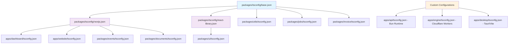
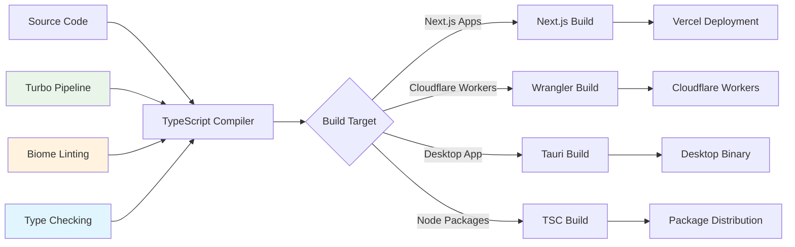
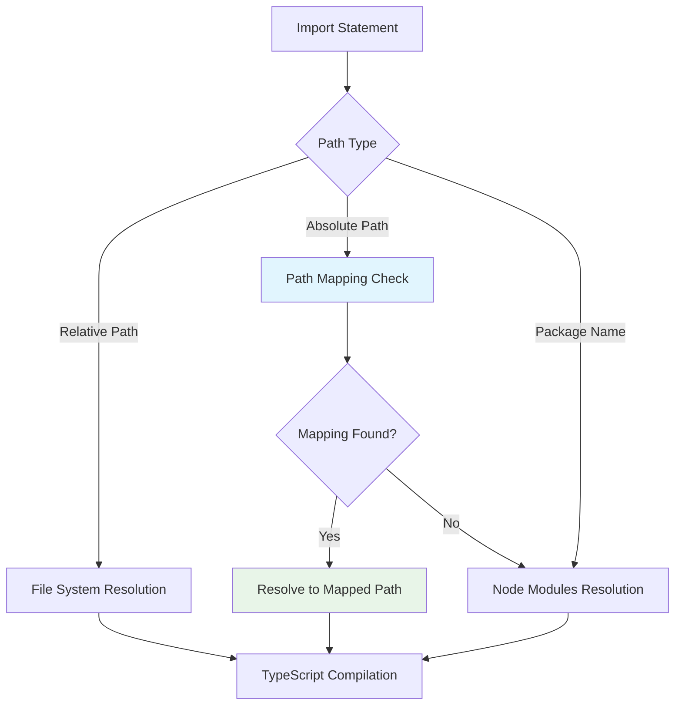

# TypeScript Configuration Architecture

## Executive Summary

The Midday project employs a sophisticated TypeScript configuration architecture designed for a modern monorepo with multiple deployment targets. The setup leverages a hierarchical configuration system with shared base configurations and environment-specific overrides, supporting Next.js applications, Cloudflare Workers, Tauri desktop applications, and Node.js packages.

**Key Architectural Decisions:**
- **Centralized Configuration**: Shared TypeScript configurations in `@midday/tsconfig` package
- **Environment-Specific Inheritance**: Base configuration extended for Next.js, React libraries, and custom environments
- **Modern Module System**: ESNext/NodeNext module resolution with bundler-optimized settings
- **Strict Type Safety**: Comprehensive strict mode with additional safety checks
- **Monorepo Path Mapping**: Cross-package imports via TypeScript path aliases
- **Build Tool Integration**: Seamless integration with Next.js, Turbo, Bun, and Wrangler

## Configuration Architecture

### Configuration Hierarchy



### Build Pipeline Flow



## Detailed Configuration Analysis

### Base Configuration (`packages/tsconfig/base.json`)

<augment_code_snippet path="packages/tsconfig/base.json" mode="EXCERPT">
````json
{
  "$schema": "https://json.schemastore.org/tsconfig",
  "display": "Default",
  "compilerOptions": {
    "esModuleInterop": true,
    "incremental": false,
    "isolatedModules": true,
    "lib": ["es2022", "DOM", "DOM.Iterable"],
    "module": "NodeNext",
    "moduleDetection": "force",
    "moduleResolution": "NodeNext"
  }
}
````
</augment_code_snippet>

**Key Features:**
- **Target**: ES2022 for modern JavaScript features
- **Module System**: NodeNext for optimal Node.js compatibility
- **Libraries**: ES2022 + DOM APIs for universal compatibility
- **Safety**: `isolatedModules` ensures each file can be compiled independently
- **Strict Mode**: Comprehensive type checking with `noUncheckedIndexedAccess`

### Next.js Configuration (`packages/tsconfig/nextjs.json`)

<augment_code_snippet path="packages/tsconfig/nextjs.json" mode="EXCERPT">
````json
{
  "extends": "./base.json",
  "compilerOptions": {
    "plugins": [{ "name": "next" }],
    "module": "ESNext",
    "moduleResolution": "Bundler",
    "allowJs": true,
    "jsx": "preserve",
    "noEmit": true
  }
}
````
</augment_code_snippet>

**Optimizations:**
- **Next.js Plugin**: Enhanced IDE support and type checking
- **Bundler Resolution**: Optimized for webpack/bundler environments
- **JSX Preservation**: Allows Next.js to handle JSX transformation
- **No Emit**: TypeScript used only for type checking, not compilation

### React Library Configuration (`packages/tsconfig/react-library.json`)

<augment_code_snippet path="packages/tsconfig/react-library.json" mode="EXCERPT">
````json
{
  "extends": "./base.json",
  "compilerOptions": {
    "jsx": "react-jsx"
  }
}
````
</augment_code_snippet>

**Purpose**: Optimized for React component libraries with automatic JSX runtime.

## Application-Specific Configurations

### Dashboard Application (`apps/dashboard/tsconfig.json`)

<augment_code_snippet path="apps/dashboard/tsconfig.json" mode="EXCERPT">
````json
{
  "extends": "@midday/tsconfig/nextjs.json",
  "compilerOptions": {
    "baseUrl": ".",
    "paths": {
      "@/*": ["./src/*"],
      "@api/*": ["../api/src/*"],
      "@engine/*": ["../engine/src/*"],
      "@jobs/*": ["../../packages/jobs/src/*"]
    }
  }
}
````
</augment_code_snippet>

**Cross-Package Imports**: Enables direct imports from other monorepo packages without relative paths.

### API Service (`apps/api/tsconfig.json`)

<augment_code_snippet path="apps/api/tsconfig.json" mode="EXCERPT">
````json
{
  "compilerOptions": {
    "target": "ESNext",
    "module": "ESNext",
    "moduleResolution": "bundler",
    "allowImportingTsExtensions": true,
    "verbatimModuleSyntax": true,
    "types": ["bun-types"]
  }
}
````
</augment_code_snippet>

**Bun Runtime Optimization**: Custom configuration for Bun's JavaScript runtime with modern ES features.

### Engine Service (`apps/engine/tsconfig.json`)

<augment_code_snippet path="apps/engine/tsconfig.json" mode="EXCERPT">
````json
{
  "compilerOptions": {
    "types": ["@cloudflare/workers-types", "bun-types"],
    "jsx": "react-jsx",
    "jsxImportSource": "hono/jsx"
  }
}
````
</augment_code_snippet>

**Cloudflare Workers**: Specialized for edge computing with Hono framework JSX support.

## Module Resolution Strategy



### Path Mapping Examples

| Import | Resolves To | Purpose |
|--------|-------------|---------|
| `@/*` | `./src/*` | Local source files |
| `@api/*` | `../api/src/*` | API service imports |
| `@engine/*` | `../engine/src/*` | Engine service imports |
| `@jobs/*` | `../../packages/jobs/src/*` | Jobs package imports |

## Build Integration

### Turbo Pipeline Integration

<augment_code_snippet path="turbo.json" mode="EXCERPT">
````json
{
  "tasks": {
    "typecheck": {
      "dependsOn": ["^topo"],
      "outputs": []
    },
    "build": {
      "dependsOn": ["^build"],
      "outputs": [".next/**", "dist/**"]
    }
  }
}
````
</augment_code_snippet>

**Pipeline Benefits:**
- **Dependency Ordering**: Type checking follows topological order
- **Parallel Execution**: Independent packages type-check simultaneously
- **Caching**: TypeScript compilation results cached across builds

### Next.js Integration

<augment_code_snippet path="apps/dashboard/next.config.mjs" mode="EXCERPT">
````javascript
const config = {
  typescript: {
    ignoreBuildErrors: true,
  },
  transpilePackages: [
    "@midday/ui",
    "@midday/tailwind",
    "@midday/invoice",
    "@midday/api",
  ]
}
````
</augment_code_snippet>

**Transpilation Strategy**: Monorepo packages transpiled during Next.js build for optimal bundling.

## Development vs Production

### Development Configuration
- **Incremental Compilation**: Disabled for consistency
- **Source Maps**: Enabled for debugging
- **Hot Reload**: Supported via `--turbopack` flag
- **Type Checking**: Real-time via IDE integration

### Production Configuration
- **Build Optimization**: Tree shaking and dead code elimination
- **Declaration Generation**: Type definitions for published packages
- **Minification**: Handled by respective build tools
- **Error Handling**: Strict type checking enforced

## Performance Considerations

### Compilation Speed Optimizations

1. **`skipLibCheck: true`**: Skips type checking of declaration files
2. **`isolatedModules: true`**: Enables parallel compilation
3. **`incremental: false`**: Prevents incremental cache issues in CI
4. **Selective Includes**: Only necessary files included in compilation

### Memory Usage Optimization

1. **`noEmit: true`**: Reduces memory usage in Next.js apps
2. **Modular Configurations**: Smaller compilation units
3. **Path Mapping**: Reduces module resolution overhead

## Rationale and Design Decisions

### Why NodeNext Module Resolution?

**Trade-offs Considered:**
- **Compatibility**: Full Node.js ecosystem compatibility
- **Future-Proofing**: Aligns with Node.js ESM direction
- **Performance**: Optimal resolution for server-side code

**Alternative Rejected**: `"moduleResolution": "node"` - Legacy resolution strategy

### Why Separate Configurations?

**Benefits:**
- **Environment Optimization**: Each target optimized for its runtime
- **Maintainability**: Clear separation of concerns
- **Flexibility**: Easy to modify specific environments

**Trade-offs:**
- **Complexity**: More configuration files to maintain
- **Consistency**: Requires careful inheritance management

### Why Strict Type Checking?

**Enabled Strict Options:**
- `strict: true` - All strict checks enabled
- `noUncheckedIndexedAccess: true` - Prevents undefined access
- `noFallthroughCasesInSwitch: true` - Prevents switch fallthrough bugs

**Benefits:**
- **Runtime Safety**: Catches errors at compile time
- **Code Quality**: Enforces best practices
- **Refactoring Safety**: Confident code changes

## Troubleshooting Common Issues

### Module Resolution Errors

**Problem**: Cannot find module '@/components/ui'
**Solution**: Verify path mapping in tsconfig.json and baseUrl setting

**Problem**: Type errors in monorepo imports
**Solution**: Ensure target package has proper TypeScript configuration

### Build Performance Issues

**Problem**: Slow TypeScript compilation
**Solution**: Enable `skipLibCheck` and verify include/exclude patterns

**Problem**: Memory issues during build
**Solution**: Use `noEmit: true` for Next.js apps and optimize include patterns

### IDE Integration Issues

**Problem**: IntelliSense not working for path mappings
**Solution**: Restart TypeScript service and verify workspace configuration

**Problem**: Incorrect type checking in IDE
**Solution**: Ensure IDE uses workspace TypeScript version

## Future Considerations

### Potential Improvements

1. **Project References**: Consider TypeScript project references for better incremental builds
2. **Composite Builds**: Enable composite mode for faster rebuilds
3. **Type-Only Imports**: Leverage `import type` for better tree shaking
4. **Module Detection**: Fine-tune `moduleDetection` for optimal performance

### Migration Strategies

1. **TypeScript 5.x Features**: Gradual adoption of new compiler options
2. **ESM Migration**: Transition to full ESM when ecosystem ready
3. **Build Tool Updates**: Keep pace with Next.js and bundler improvements

---

*This documentation reflects the current state of TypeScript configuration as of the analysis date. Regular updates recommended as the project evolves.*
